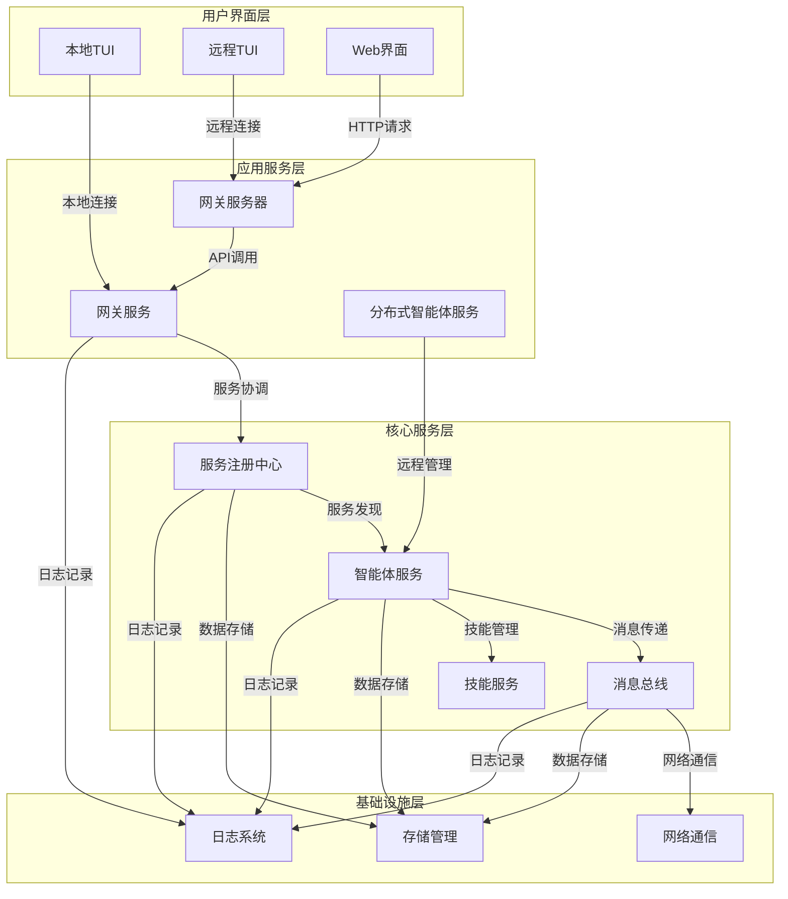
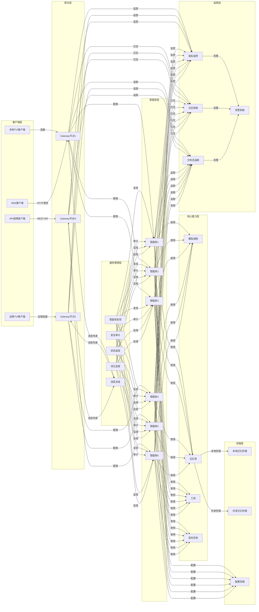
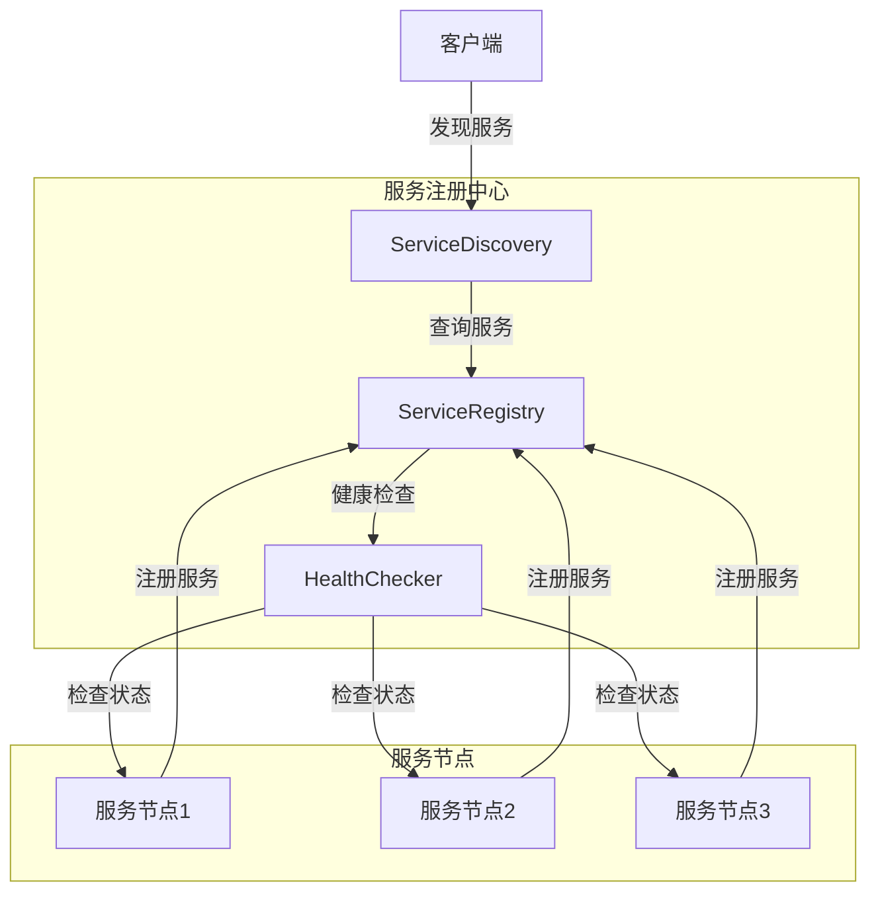
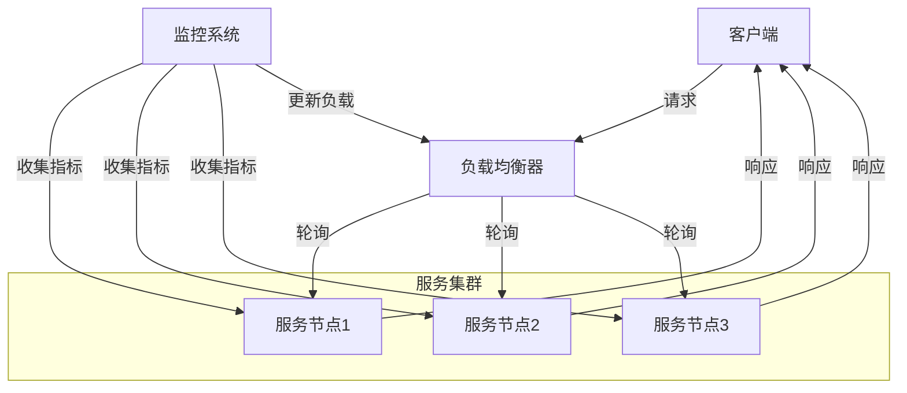
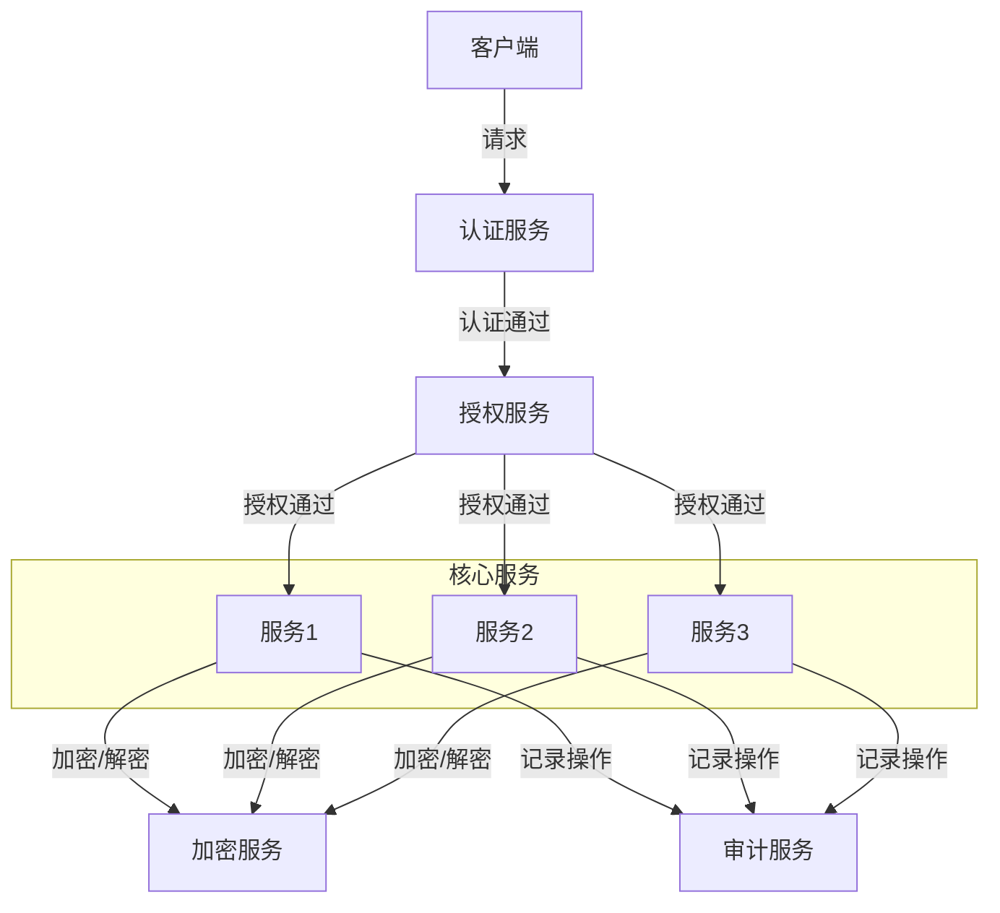
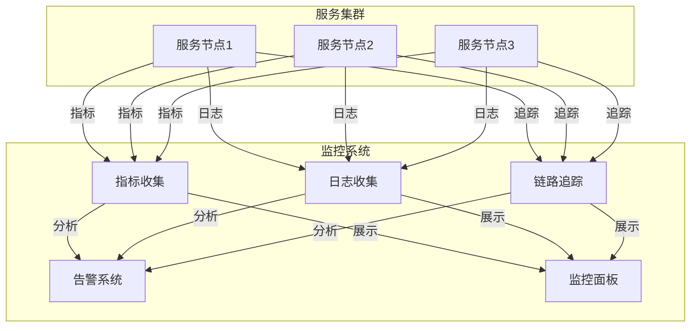
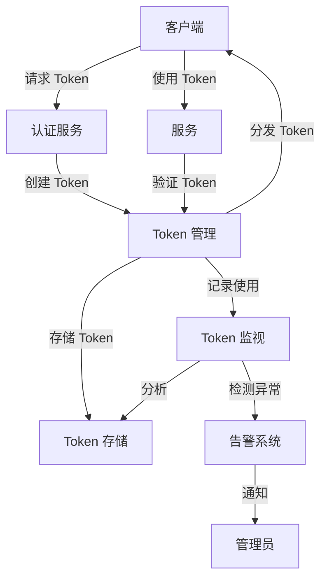

# DFEcrab 功能设计文档

## 1. 架构概述

DFEcrab 采用 **微内核 + 服务化** 架构，支持从单机部署到分布式多节点协同的演进路径。系统以智能体管理为核心，通过服务注册、消息总线实现跨节点通信和协同。

### 1.1 设计原则

- **模块化**：核心功能与扩展功能分离，便于维护和扩展
- **可扩展性**：支持水平扩展，适应不同规模的部署需求
- **可靠性**：完善的错误处理和故障恢复机制
- **安全性**：内置安全措施，保护系统和数据安全
- **可观测性**：全面的监控和日志系统

### 1.2 架构层次

DFEcrab 系统采用分层架构设计，从下到上依次为：

| 层次 | 组件 | 功能 | 实现文件 |
|------|------|------|----------|
| **基础设施层** | 网络通信 | 提供节点间通信能力 | `src/core/agent_service_remote.py` |
| | 存储管理 | 管理配置和状态数据 | `src/core/memory_service.py` |
| | 日志系统 | 记录系统运行状态 | `src/core/logger.py` |
| **核心服务层** | 服务注册中心 | 管理服务注册和发现 | `src/core/service_registry.py` |
| | 智能体服务 | 管理智能体生命周期 | `src/core/agent_service.py` |
| | 消息总线 | 实现跨节点通信 | `src/core/message_bus.py` |
| | 技能服务 | 管理智能体技能 | `src/core/skill_service.py` |
| **应用服务层** | 网关服务 | 服务协调和 API 暴露 | `src/core/gateway_v2.py` |
| | 网关服务器 | 提供 REST API 接口 | `src/core/gateway_server.py` |
| | 分布式智能体服务 | 管理远程智能体节点 | `src/core/agent_service_remote.py` |
| **用户界面层** | 本地 TUI | 提供本地终端界面 | `src/core/tui_v2.py` |
| | 远程 TUI | 提供远程终端界面 | `src/core/tui_remote.py` |
| | Web 界面 | 提供 Web 访问能力（预留） | - |

### 1.3 整体架构图

### 1.4 整体系统设计图（智能体为核心）

### 1.5 架构演进路径

| 阶段 | 部署模式 | 核心功能 | 扩展能力 |
|------|----------|----------|----------|
| 阶段1 | 单机部署 | 本地智能体管理、基础服务 | 单节点功能完备 |
| 阶段2 | 多节点部署 | 远程节点管理、跨节点通信 | 有限的分布式能力 |
| 阶段3 | 分布式架构 | 服务发现、负载均衡、高可用 | 完整的分布式协同 |

## 2. 核心功能模块

### 2.1 服务注册中心

**功能**：管理所有服务的注册、发现和生命周期

**核心组件**：
- ServiceRegistry：服务注册和发现
- ServiceInterface：服务接口定义
- EventBus：事件总线

**设计要点**：
- 支持服务的动态注册和发现
- 提供服务健康检查机制
- 实现服务依赖管理
- 支持服务版本控制

### 2.2 智能体服务

**功能**：管理智能体的创建、切换、移除和对话

**核心组件**：
- AgentService：本地智能体管理
- DistributedAgentService：分布式智能体管理
- RemoteAgentNode：远程节点管理
- RemoteAgentClient：远程节点通信

**设计要点**：
- 统一的智能体管理接口
- 支持本地和远程智能体
- 实现智能体状态管理
- 提供智能体对话功能

### 2.3 消息总线

**功能**：实现智能体之间的跨节点通信

**核心组件**：
- MessageBus：消息总线核心
- Message：消息对象
- Subscription：消息订阅

**设计要点**：
- 支持多种消息类型（普通消息、通知、命令）
- 实现消息的可靠投递
- 支持消息订阅机制
- 提供消息路由和分发

### 2.4 网关服务

**功能**：服务协调和 API 暴露

**核心组件**：
- GatewayV2：轻量级网关
- GatewayServer：REST API 服务器
- RouteManager：路由管理

**设计要点**：
- 统一的 API 接口
- 服务协调和调用
- 负载均衡和容错
- 安全认证和授权

### 2.5 终端界面

**功能**：提供用户交互界面

**核心组件**：
- DFEcrabTUIV2：本地 TUI
- DFEcrabTUIRemote：远程 TUI
- CommandHandler：命令处理

**设计要点**：
- 支持本地和远程操作
- 提供丰富的命令和功能
- 实现友好的用户界面
- 支持命令历史和自动补全

## 3. 服务发现机制

### 3.1 设计目标

- 自动发现网络中的服务节点
- 实时更新服务状态
- 支持服务健康检查
- 提供服务元数据管理

### 3.2 实现方案

**1. 基于 HTTP 的服务注册**
- 服务启动时向注册中心注册
- 定期发送心跳保持注册状态
- 服务下线时自动注销

**2. 服务发现协议**
- 支持基于 DNS 的服务发现
- 支持基于 Consul 的服务发现
- 支持基于 etcd 的服务发现

**3. 服务健康检查**
- 定期检查服务状态
- 自动剔除不健康的服务
- 支持自定义健康检查策略

### 3.3 架构设计

## 4. 负载均衡策略

### 4.1 设计目标

- 均匀分配请求负载
- 支持多种负载均衡算法
- 考虑服务健康状态
- 支持会话保持

### 4.2 实现方案

**1. 负载均衡算法**
- 轮询（Round Robin）：均匀分配请求
- 权重轮询：根据服务能力分配请求
- 最少连接：分配到当前连接数最少的服务
- 随机：随机选择服务节点

**2. 负载均衡策略**
- 静态负载均衡：基于配置的负载均衡
- 动态负载均衡：基于实时服务状态的负载均衡
- 自适应负载均衡：根据历史负载自动调整

**3. 会话管理**
- 会话保持：同一客户端的请求路由到同一服务
- 会话复制：在服务节点间复制会话数据
- 会话持久化：将会话数据持久化到存储

### 4.3 架构设计

## 5. 安全增强措施

### 5.1 设计目标

- 保护系统和数据安全
- 防止未授权访问
- 加密敏感数据
- 审计和日志记录

### 5.2 实现方案

**1. 认证机制**
- 基于 Token 的认证
- 支持 OAuth 2.0
- 支持 JWT 令牌
- 多因素认证

**2. 授权机制**
- 基于角色的访问控制（RBAC）
- 基于策略的访问控制（PBAC）
- 细粒度权限管理
- 权限继承和覆盖

**3. 数据安全**
- 传输加密（TLS/SSL）
- 存储加密
- 敏感数据脱敏
- 数据访问审计

**4. 网络安全**
- 防火墙规则
- 网络隔离
- DDoS 防护
- 入侵检测

### 5.3 架构设计

## 6. 监控和流量管理

### 6.1 设计目标

- 实时监控系统状态
- 跟踪和分析流量
- 识别性能瓶颈
- 预测系统负载

### 6.2 实现方案

**1. 监控系统**
- 服务健康监控
- 资源使用监控
- 性能指标监控
- 错误率监控

**2. 流量管理**
- 流量控制：限制请求速率
- 流量整形：平滑流量峰值
- 流量分析：识别异常流量
- 流量预测：基于历史数据预测

**3. 告警系统**
- 阈值告警：基于预设阈值
- 趋势告警：基于指标趋势
- 智能告警：基于机器学习
- 告警分级：严重程度分级

**4. 日志系统**
- 结构化日志
- 日志聚合
- 日志分析
- 日志归档

### 6.3 架构设计

## 7. Token 监视系统

### 7.1 设计目标

- 监控 Token 的使用情况
- 检测异常 Token 行为
- 防止 Token 滥用
- 管理 Token 生命周期

### 7.2 实现方案

**1. Token 管理**
- Token 创建和分发
- Token 验证和撤销
- Token 过期管理
- Token 刷新机制

**2. Token 监视**
- Token 使用频率监控
- Token 访问模式分析
- 异常 Token 检测
- Token 风险评估

**3. Token 安全**
- Token 加密存储
- Token 传输安全
- Token 权限控制
- Token 审计跟踪

**4. Token 分析**
- Token 使用统计
- Token 性能分析
- Token 安全分析
- Token 优化建议

### 7.3 架构设计

## 8. 部署和扩展方案

### 8.1 单机部署

**配置**：
- 所有服务运行在同一台服务器
- 本地存储和内存管理
- 适合开发和测试环境

**优势**：
- 部署简单
- 资源占用少
- 便于调试
- 适合小规模使用

### 8.2 多节点部署

**配置**：
- 服务分布在多个服务器
- 共享存储和消息队列
- 适合生产环境

**优势**：
- 提高系统可靠性
- 增加系统容量
- 支持负载均衡
- 便于维护和升级

### 8.3 容器化部署

**配置**：
- 使用 Docker 容器
- 容器编排（Kubernetes）
- 自动化部署和扩展

**优势**：
- 环境一致性
- 快速部署和回滚
- 资源隔离
- 自动扩缩容

### 8.4 云原生部署

**配置**：
- 利用云服务提供商的资源
- 无服务器架构
- 弹性伸缩

**优势**：
- 按需付费
- 无限扩展能力
- 高可用性
- 运维成本低

## 9. 技术栈选择

### 9.1 核心技术

| 类别 | 技术 | 版本 | 用途 |
|------|------|------|------|
| 编程语言 | Python | 3.9+ | 核心开发 |
| 异步框架 | asyncio | 内置 | 异步处理 |
| HTTP 客户端 | httpx | 最新 | 网络通信 |
| 序列化 | JSON | 标准 | 数据交换 |
| 消息队列 | Redis | 最新 | 消息传递 |

### 9.2 服务发现

| 技术 | 用途 | 优势 |
|------|------|------|
| Consul | 服务注册和发现 | 功能丰富，支持健康检查 |
| etcd | 分布式键值存储 | 高一致性，适合配置管理 |
| DNS-SD | 基于 DNS 的服务发现 | 简单易用，无需额外组件 |

### 9.3 监控系统

| 技术 | 用途 | 优势 |
|------|------|------|
| Prometheus | 指标收集和存储 | 强大的查询语言，高可靠性 |
| Grafana | 监控面板 | 丰富的可视化选项 |
| Jaeger | 分布式追踪 | 详细的调用链分析 |
| ELK Stack | 日志管理 | 强大的日志分析能力 |

### 9.4 安全技术

| 技术 | 用途 | 优势 |
|------|------|------|
| JWT | 认证令牌 | 无状态，便于水平扩展 |
| OAuth 2.0 | 授权框架 | 标准化，广泛支持 |
| TLS/SSL | 传输加密 | 保护数据传输安全 |
| HashiCorp Vault | 密钥管理 | 安全的密钥存储和访问控制 |

## 10. 实施路线图

### 10.1 阶段 1：单机版开发

**时间**：1-2 个月

**目标**：
- 实现核心功能模块
- 支持本地智能体管理
- 提供基础服务接口
- 完成单机部署测试

**关键任务**：
- 服务注册中心实现
- 智能体服务实现
- 消息总线实现
- 网关服务实现
- 终端界面实现

### 10.2 阶段 2：多节点支持

**时间**：2-3 个月

**目标**：
- 支持远程节点管理
- 实现跨节点通信
- 提供基本的负载均衡
- 完成多节点部署测试

**关键任务**：
- 分布式智能体服务实现
- 跨节点消息传递
- 基础服务发现
- 简单负载均衡

### 10.3 阶段 3：分布式架构

**时间**：3-4 个月

**目标**：
- 完整的服务发现机制
- 高级负载均衡策略
- 安全增强措施
- 监控和流量管理
- Token 监视系统

**关键任务**：
- 服务发现实现
- 负载均衡优化
- 安全机制增强
- 监控系统集成
- Token 监视实现

### 10.4 阶段 4：云原生支持

**时间**：2-3 个月

**目标**：
- 容器化部署
- 云服务集成
- 弹性伸缩
- 高可用性

**关键任务**：
- Docker 容器化
- Kubernetes 部署
- 云服务集成
- 自动扩缩容

## 11. 风险评估

### 11.1 技术风险

| 风险 | 影响 | 缓解措施 |
|------|------|----------|
| 服务发现机制失败 | 服务无法找到彼此 | 实现多种服务发现机制，增加冗余 |
| 负载均衡算法不当 | 系统性能下降 | 实现多种负载均衡算法，根据场景选择 |
| 安全漏洞 | 系统被攻击 | 定期安全审计，及时更新依赖 |
| 监控系统过载 | 监控数据丢失 | 实现监控数据采样和聚合 |

### 11.2 部署风险

| 风险 | 影响 | 缓解措施 |
|------|------|----------|
| 节点故障 | 服务不可用 | 实现节点冗余和故障转移 |
| 网络分区 | 系统分裂 | 实现网络分区检测和恢复机制 |
| 数据一致性 | 数据丢失或不一致 | 实现数据复制和一致性协议 |
| 资源不足 | 系统性能下降 | 实现资源监控和自动扩缩容 |

### 11.3 运维风险

| 风险 | 影响 | 缓解措施 |
|------|------|----------|
| 配置错误 | 系统故障 | 实现配置验证和版本控制 |
| 升级失败 | 服务中断 | 实现灰度发布和回滚机制 |
| 监控盲区 | 问题未及时发现 | 全面的监控覆盖和告警机制 |
| 日志过多 | 存储压力和分析困难 | 实现日志分级和轮转机制 |

## 12. 结论

DFEcrab 的功能设计文档提供了一个全面的架构和功能规划，从单机部署到分布式多节点协同，涵盖了服务发现、负载均衡、安全增强、监控流量和 Token 监视等关键功能。

该设计充分考虑了系统的可扩展性、可靠性和安全性，为 DFEcrab 的未来发展奠定了坚实的基础。通过分阶段实施，可以确保系统的稳定演进，同时满足不同规模和场景的需求。

随着技术的发展和需求的变化，该设计也可以灵活调整和扩展，以适应未来的挑战和机遇。