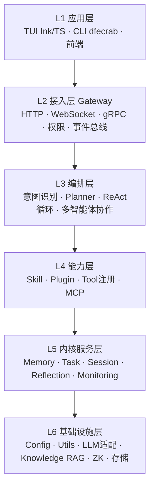

# 00 · 全局约定

> 本文件是 `docs/代码地图/` 整套文档的**元文档**。
> 在阅读其他任何一篇之前请先读它——定义了术语、标记、模板和纪律，保证 500+ 个条目口径统一。

---

## 1. 文档定位

| 项 | 内容 |
|---|---|
| **目标读者** | 需要接手 / 维护 DFEcrab 的开发人员（新人 onboarding 优先） |
| **回答的问题** | 这个目录 / 文件**是干什么的**、**和谁有关**、**改动它会影响什么** |
| **不回答的问题** | 业务逻辑细节、算法原理、产品需求（那些看 `docs/设计说明书/`） |
| **证据来源** | 全部基于实际读取的源码，不含推测 |
| **起始时间** | 2026-08-29 |

---

## 2. 术语表

### 2.1 架构角色

| 术语 | 含义 | 本项目中的实体 |
|---|---|---|
| **Gateway** | 对外统一接入层，HTTP / WebSocket / gRPC 路由与服务编排 | `src/gateway/`（`grpc_server.py` 为主实现，`legacy.py` 为旧版） |
| **Agent** | 具备推理 + 工具调用能力的执行体 | `src/agent/`、`agents/*.json` |
| **Manager Agent** | 多智能体编排者，负责任务分派与结果汇总 | `services/manager_agent/manager_agent_grpc.py`、`src/agent/multi/` |
| **Worker Agent** | 被 Manager 调度的具体执行智能体 | `services/agent_service/agent_service_grpc.py` |
| **ReAct** | Reasoning + Acting 循环：思考、调工具、观察、再思考 | `src/agent/loop.py` |
| **Planner** | 把复杂任务拆解为多步计划 | `src/agent/planner.py`、`skills/planner/` |
| **Skill（技能）** | 一个目录 = 一个能力单元（`SKILL.md` + `execute.py` + `_meta.json`），**会被 SkillLoader 扫描加载** | `skills/<name>/` |
| **Plugin（插件）** | 实现 `BasePlugin` 接口的 Python 类，注册进 `PluginRegistry` | `src/plugin_framework/` |
| **Tool（工具）** | 可被 LLM 通过 function calling 调用的最小单元，由 Skill 注册而来 | 由 `src/skill/registry.py` 管理 |
| **MCP** | Model Context Protocol，外部工具服务协议 | `src/mcp/`、`mcp_servers/`、`config/mcporter.json` |
| **ZK** | Zookeeper，用于 Agent 服务注册与发现 | `src/gateway/grpc/zk_registry.py`，依赖 `kazoo` |
| **KB** | Knowledge Base 知识库（向量检索 + RAG 问答），默认端口 6788 | `src/knowledge/`、`knowledge_base/` |

### 2.2 数据概念

| 术语 | 含义 |
|---|---|
| **Session** | 一次会话上下文，含历史消息 |
| **短期记忆** | 当前会话窗口内的消息 |
| **长期记忆** | 跨会话持久化的记忆 |
| **共享记忆** | 多个 Agent 之间共享的记忆区 |
| **Reflection** | 反思：对对话样本分析后生成改进行动 |
| **Task** | 任务实体，含状态机、调度、监督 |

### 2.3 三组必须区分的易混概念

| 易混对 | 区别 |
|---|---|
| **`skills/` vs `plugins/`** | `skills/` 是**真正被加载**的技能目录（由 `src/skill/loader.py` 扫描）；顶层 `plugins/` 目录**未被任何加载器扫描**，是历史遗留 |
| **`src/plugins/` vs `src/plugin_framework/`** | `src/plugins/` 只是**向后兼容壳**（4 个文件全部 re-export `src/plugin_framework`），不是重复实现 |
| **`config/` vs `src/config/`** | 根 `config/` 只放 **json / yaml 数据文件**（无 .py）；`src/config/` 才是 **Python 配置模块**（`config_loader.py` / `port_loader.py` / `config.py`） |

---

## 3. 代码使用状态标记

> 核心分类体系：区分"**正在使用**"、"**还没接上**"、"**没写完**"、"**已废弃**"、"**项目环境**"，避免一刀切把未使用的代码误判为"可删"。

### 3.1 五类核心标记（按使用状态）

| 标记 | 含义 | 典型场景 |
|---|---|---|
| **`[主使用]`** | 正在被运行时加载、调用 | `src/gateway/grpc_server.py`、`skills/*/execute.py`、`config/gateway.yaml` |
| **`[未启用]`** | 代码写好了、也有对应 loader 设计，但**当前还没接进去**。不是废弃，是还在 roadmap 上 | 顶层 `plugins/`（plugin_framework/loader 硬编码只加载 DFEcrabAgentPlugin，未扫描 plugins/，但目录结构完整、execute.py 可用） |
| **`[开发中]`** | 代码半成品，**引用未完成**或**功能未落地**，暂时跑不起来 | `task_engine/`（孤立模块无外部引用）、`self-improving-agent/`（import 了不存在的符号） |
| **`[已废弃]`** | 旧版本残留，新代码已不使用，可安全清理 | `scripts/rebuild_index.py`（三个索引重建脚本重叠，此为最旧版本） |
| **`[项目环境]`** | 项目的**运行依赖/部署环境**，不是源码但部署必需 | `venv/`（Python 虚拟环境）、`wheels/`（pip 离线安装包）、`runtime/`（Alpine musl Node.js） |

### 3.2 辅助标记（用于精确描述特殊情况）

| 标记 | 含义 |
|---|---|
| `[兼容壳]` | 仅做 re-export，为保持旧 import 路径不报错而存在（`src/plugins/` 4 个文件） |
| `[已损坏]` | 引用了当前代码库中**不存在的符号**，运行时必然报错（`self-improving-agent` 的死 import） |
| `[运行时产物]` | 程序运行中生成，不是源码（`logs/`、`data/`、`knowledge_base/index/`） |
| `[重复]` | 与另一份文件/目录功能相同或高度相似（`plugins/*` 与 `skills/*` 逐文件重复） |
| `[待确认]` | 编写时无法确定，需业务方 / 原作者确认 |

### 3.3 标记使用原则

1. **优先用核心 5 类**（主使用/未启用/开发中/已废弃/项目环境），辅助标记补充细节
2. **`[未启用]` ≠ `[已废弃]`**：未启用是"设计了但还没接"，可能在 roadmap 上；已废弃是"确认不再需要"
3. **`[项目环境]` 不能和 `[运行时产物]` 混**：项目环境部署时就要带上；运行时产物是启动后才生成的
4. 一个文件可以同时带**一个核心标记 + 一个辅助标记**，例如 `plugins/*/execute.py` → `[未启用] + [重复]`

---

## 4. 架构分层定义



| 标签 | 全称 | 典型目录 |
|---|---|---|
| L1 | 应用层 | `tui/`、`dfecrab` |
| L2 | 接入层 | `src/gateway/` |
| L3 | 编排层 | `src/agent/` |
| L4 | 能力层 | `skills/`、`plugins/`、`src/skill/`、`src/plugin_framework/`、`mcp_servers/` |
| L5 | 内核服务层 | `src/memory/`、`src/task/`、`src/session/`、`src/reflection/`、`src/monitoring/` |
| L6 | 基础设施层 | `src/config/`、`src/utils/`、`src/knowledge/`、`src/agent/llm/` |
| — | 运维 / 质量 | `scripts/`、`services/`、`tests/`、`task_engine/` |
| — | 资产 / 数据 | `config/`、`agents/`、`knowledge_base/`、`models/`、`data/`、`decks/` |

---

## 5. 条目模板

### 5.1 目录条目模板

````markdown
## src/agent/

| 项 | 内容 |
|---|---|
| **定位** | 一句话说明它在架构里扮演什么角色 |
| **分层** | L3 编排层 |
| **规模** | 17 个 .py |
| **上游（谁用它）** | `src/gateway/handlers/agent_handler.py` |
| **下游（它用谁）** | `src.agent.llm.adapter`、`src.memory`、`src.skill.loader` |
| **关键约定** | max_iterations 实际由 `config/dfecrab.json` 的 `agent_defaults` 决定（**= 10**）；代码内三处兜底值分别为 `ReActLoop.__init__`=3、`run_react_loop()`=5、`AgentConfig`=3 |
| **已知坑** | IntentClassifier 的 hardcoded patterns 已迁移，类内默认值为空 |

### 子目录 / 文件清单
（表格列出每个条目的一句话职责）
````

### 5.2 文件条目模板

````markdown
#### `src/agent/intent_classifier.py`

| 项 | 内容 |
|---|---|
| 类型 | 核心逻辑 · 分类器 |
| 规模 | 229 行 / 1 类 / 6 方法 |
| 职责 | 将用户消息分为 chat / task / complex 三类，决定后续走直答、ReAct 还是 Planner |
| 核心符号 | `IntentClassifier.classify()` · `._rule_classify()` · `._llm_classify()` · `get_intent_classifier()` |
| 被调用方 | `src/agent/loop.py`、`src/gateway/handlers/agent_handler.py` |
| 依赖 | `src.agent.llm.adapter.LLMAdapter`（函数内延迟 import） |
| 关键行为 | ① has_skills=False 直接返回 chat；② LLM 分类 3s 超时降级规则；③ 规则 patterns 由构造参数注入 |
| 关联文件 | `agents/manager_agent/config.json`(intent_patterns)、`src/agent/agent_config.py` |
| 备注 | docstring 仍写「LLM 模式（可选）」，实际已是默认路径，文档滞后于实现 |
````

### 5.3 字段填写规则

| 字段 | 规则 |
|---|---|
| 类型 | 固定枚举：`核心逻辑` / `适配器` / `路由` / `服务` / `模型实体` / `工具类` / `配置` / `常量枚举` / `兼容壳` / `测试` / `脚本` / `文档` |
| 规模 | 行数 / 类数 / 方法数，**必须实际统计**，不估算 |
| 核心符号 | 只列**外部会用到**的公开符号；私有方法仅在其为关键行为载体时列出 |
| 被调用方 | **必须是实际 grep 到的 import 位置**，不写「应该被 XX 调用」 |
| 依赖 | 同样必须实际 import，并区分「模块顶层 import」与「函数内延迟 import」 |
| 关键行为 | 只写**非常规**行为：降级、兜底、超时、黑名单、优先级反转等。平铺直叙的代码不写 |
| 备注 | 写**代码与文档不一致**、**命名不规范**、**疑似 bug** 这类观察 |

---

## 6. 覆盖范围与排除规则

| 层级 | 覆盖 | 粒度 | 说明 |
|---|---|---|---|
| **A 级** | `src/**`、`skills/**`、`plugins/**`、`scripts/`、`services/`、`tests/`、`task_engine/`、`examples/` | 逐文件，8–15 行/个 | 真实源码，重点投入 |
| **B 级** | `docs/**`、`前端对接文档/`、根 `README.md` | 逐篇，5–8 行/篇 | 写清「讲什么 / 给谁看 / 对应哪些代码」 |
| **C 级** | `config/`、`agents/`、`knowledge_base/`、`models/`、`data/`、`decks/`、`mcp_servers/`、`tui/` | 目录一段话 + 关键文件展开 | 配置与资产 |
| **跳过** | `venv/`、`__pycache__/`、`*.pyc`、`node_modules/`、`tui/dist/`、`runtime/`、`wheels/`、`*.faiss` / `*.bin` / `*.pkl` / `*.whl` | 仅在目录说明中标注一行 | 第三方 / 生成物 |

**特例：**

- `plugins/` 虽判定为僵尸目录，仍**完整编写文档**——只有写清「它是什么、为什么没被加载」，才能支撑后续清理决策，每条打 `[僵尸代码]` 标记。
- `skills/self-improving-agent/` 等引用了不存在符号的技能，仍完整编写并打 `[已损坏]` 标记。
- `services/` 下两个 gRPC 服务文件体积异常（144 KB / 135 KB），需重点确认是手写实现还是生成产物。

---

## 7. 编写纪律

1. **不编造**：每个条目都基于实际读到的代码。读不懂的标 `[待确认]`，不猜。
2. **不跳读**：大文件也实际读取后再写，绝不只看文件名推断职责。
3. **规模自证**：写「N 行 / M 类 / K 方法」前必须真的数过。
4. **调用关系可追溯**：`被调用方` / `依赖` 两栏必须来自 grep 结果，不接受经验判断。
5. **阶段门控**：每阶段结束报「完成 N 条 + 发现 M 个新疑点」，确认后再进下一阶段。
6. **发现即记录**：遇到疑似 bug、命名不规范、文档与实现不一致，当场记录在条目的「备注」栏，并同步汇总到 `09-冗余重复专项报告.md`。

---

## 8. 文档版本

| 日期 | 阶段 | 变更 |
|---|---|---|
| 2026-08-29 | 阶段 0 | 创建本文件，确立术语表、标记、模板、分层与纪律 |
