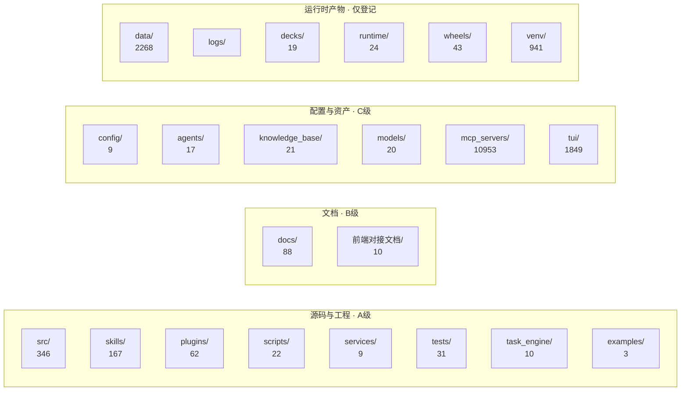

# 01 · 顶层目录总览

> 本文件是 [CODEMAP.md](./CODEMAP.md) 第 6 节的**展开版**：对仓库顶层每一个目录、每一个根级文件给出完整描述。
>
> 统计口径：文件数统计于 2026-08-29，已排除 `venv/`、`__pycache__/`、`node_modules/`。
> 标记含义见 [00-全局约定.md](./00-全局约定.md) 第 3 节。

---

## 0. 总览

| 分类 | 目录数 | 是否逐文件编写 |
|---|---|---|
| 源码与工程 | 8 | ✅ A 级 |
| 文档 | 2 | ✅ B 级 |
| 配置与资产 | 6 | ⚠️ C 级（目录级 + 关键文件） |
| 运行时产物 / 第三方 | 6 | ❌ 仅登记 |
| 空目录 | 2（`proto/`、`reflections/`） | ❌ |
| 根级文件 | 4 | ✅ |

---

## 1. 源码与工程目录（A 级 · 逐文件详写）

### 1.1 `src/`

| 项 | 内容 |
|---|---|
| **定位** | **整个项目的核心 Python 源码**，所有业务逻辑、服务、框架的所在地 |
| **分层** | 横跨 L2–L6（接入层 → 基础设施层） |
| **规模** | 346 个文件：149 个 .py、192 个 .pyc、1 个 .proto、1 个 .html、1 个 .db |
| **上游（谁用它）** | 根 `dfecrab` CLI、`scripts/` 下各启动脚本、`tests/`、`services/` |
| **下游（它用谁）** | 读 `config/*.json`、`agents/*.json`、`knowledge_base/`、`models/` |
| **关键约定** | 所有模块以 `src.` 为前缀绝对导入；`src/__init__.py` 提供 `PROJECT_ROOT` 与 `get_xxx_path()` 系列路径工具 |
| **已知坑** | `src/mcp/` 与 pip 的第三方 `mcp` 包同名，会导致 `import mcp.types` 解析错误——`dfecrab` 启动 MCP 子进程时专门清除 `PYTHONPATH` 规避 |

**17 个子目录（16 个代码包 + 1 个日志目录），.py 合计 149 个（含 `src/` 根下 3 个）：**

| 路径 | .py 数 | 分层 | 职责 |
|---|---|---|---|
| `gateway/` | 31 | L2 | 网关与协议接入（gRPC / HTTP / WebSocket / 权限 / 事件总线） |
| `agent/` | 17 | L3 | ReAct 循环、意图识别、Planner、LLM 适配、多智能体协作 |
| `skill/` | 4 | L4 | 技能加载器与工具注册表 |
| `plugin_framework/` | 4 | L4 | 插件基类、注册表、加载器 |
| `plugins/` | 4 | L4 | `[兼容壳]` 向后兼容层，全部 re-export `plugin_framework` |
| `memory/` | 20 | L5 | 短期 / 长期 / 共享记忆、语义检索、压缩 |
| `task/` | 16 | L5 | 任务管理、调度、监督、API 路由 |
| `session/` | 3 | L5 | 会话生命周期与历史过滤 |
| `reflection/` | 3 | L5 | 反思报告、事件索引 |
| `monitoring/` | 4 | L5 | 性能指标、Hook、运行时不变量 |
| `knowledge/` | 19 | L6 | 知识库：嵌入、RAG、存储、检索 |
| `config/` | 4 | L6 | 配置加载器（`config_loader` / `port_loader` / `config`） |
| `utils/` | 7 | L6 | 日志处理、时间解析、词表、Mermaid 校验 |
| `mcp/` | 2 | L6 | MCP HTTP 客户端 |
| `services/` | 3 | L6 | 服务注册表与模型管理器 |
| `core/` | 3 | L6 | 错误类型、事件类型常量 |
| `logs/` | 0 | — | `[运行时产物]` AgentScope 运行日志，内含 1 个 .db |

**根级文件：** `__init__.py`（路径工具）、`__main__.py`（argparse 次入口）、`agentscope_compat.py`（AgentScope 兼容层）

> **注**：`src/logs/agentscope/run_20260327-215912_kxpg5w/agentscope.db`（12 KB）是 2026-03-27 的一次运行产物，**误提交进了源码目录**，建议加入 `.gitignore`。
> 详细分解见 `02-src核心包/` 下 8 篇文档。

---

### 1.2 `skills/`

| 项 | 内容 |
|---|---|
| **定位** | **技能实现目录，系统唯一真正被加载的能力来源** |
| **分层** | L4 能力层 |
| **规模** | 167 个文件：58 md、48 py、37 pyc、14 json、2 sh、1 zip；共 **47 个技能子目录** |
| **上游（谁用它）** | `src/skill/loader.py` 的 `SkillLoader` |
| **下游（它用谁）** | `src.agent`、`src.memory`、`src.knowledge`、外部 HTTP API |
| **加载机制** | `SkillLoader._get_skills_dir()` 硬编码扫描项目根 `skills/`；对每个子目录读取 `SKILL.md`（含 YAML frontmatter）、`_meta.json`、`execute.py` 中的 `SKILL_METADATA` 常量（用 `ast` 静态解析，不导入模块） |
| **匹配机制** | 关键词打分（中英文分词 + 停用词过滤）+ trigger 命中 + 中文短语命中，取 Top 3 注入 system prompt |
| **关键约定** | 技能目录名即 skill_id；`execute.py` 必须定义 `SKILL_METADATA` 字典才会被提取元信息 |

**全部 47 个技能目录（按功能归类）：**

| 类别 | 数量 | 技能 |
|---|---|---|
| 电网业务 | 9 | `dm_query`、`dm_meta`、`dm_test`、`kunming_api`、`kunming_classifier`、`kunming_theory_qa`、`load_analysis`、`power_transfer_strategy`、`ft_agent` |
| 文档处理 | 6 | `pdf-reader`、`pdf-tools`、`word_read`、`excel-read`、`nano-pdf`、`guizang-ppt-skill` |
| 文件与系统 | 5 | `file_read`、`file_manager`、`list_dir`、`code_executor`、`download-install` |
| 网络 | 5 | `web_search`、`web-fetch`、`get-http`、`xurl`、`url_shortener` |
| 元技能 | 4 | `skill-creator-dfecrab`、`skill-validator-dfecrab`、`find-skill`、`self-improving-agent` |
| 时间与天气 | 4 | `get-time`、`get-weekday`、`weather`、`weather-forecast` |
| 知识库 | 3 | `knowledge_qa`、`knowledge_search`、`pdf-to-kb` |
| 记忆与规划 | 3 | `memory_maintenance`、`project_memory`、`planner` |
| 媒体 | 2 | `video-frames`、`asr_corrector` |
| 其他 | 6 | `calculate`、`echo`、`hello`、`summarize`、`clawhub`、`kdocs` |

> 目录内另有一个独立的 `kdocs.zip`（金山文档技能的发布包），不属于技能目录。
> `self-improving-agent/` 带 `[已损坏]` 标记：它 import 的 `src.agent.SelfImprovingAgent`、`src.hooks.HookManager`、`src.memory.LearningMemory` 在当前代码库中均不存在。

> 详细分解见 [03-skills技能.md](./03-skills技能.md)。

---

### 1.3 `plugins/`　**`[未启用]`**

| 项 | 内容 |
|---|---|
| **定位** | plugin_framework 插件体系的物理放置目录。**代码完整、设计了 loader，但当前未被扫描加载**（非废弃，是设计了但还没接） |
| **分层** | L4 能力层 |
| **规模** | 62 个文件：36 md、25 py、1 pyc；共 **33 个子目录**（其中 `builtin/`、`thirdparty/` 为空） |
| **上游（谁用它）** | **当前无。** 全仓库 grep 确认无任何代码扫描此目录。`PluginLoader.load_all()` 硬编码只加载 `DFEcrabAgentPlugin`，`plugin_dir` 参数接受但从未使用 |
| **下游（它用谁）** | 各 `execute.py` 依赖 `src.agent`、`src.memory` 等 |
| **关键约定** | 每个子目录含 `README.md` + `execute.py`（部分含 `SKILL.md`、`_meta.json`） |

**为什么判定为 [未启用]（证据链）：**

1. `src/plugin_framework/loader.py` 全文 49 行，`load_all()` 方法**硬编码**只做一件事：实例化 `DFEcrabAgentPlugin` 并注册进 `PluginRegistry`。没有任何目录遍历逻辑。
2. `src/skill/loader.py:65` 的 `_get_skills_dir()` 返回 `project_root / "skills"`，**只读 skills**。
3. Gateway 的 `/api/plugins` 系列接口（`src/gateway/grpc_server.py:5202`）查询的是 `PluginRegistry`，而该注册表里只有 `DFEcrabAgentPlugin` 一个实例 —— 所以这些接口**永远返回空或只有 1 项**。
4. **关键定性**：plugins/ 不是"僵尸"也不是"历史遗留"——它是 plugin_framework 体系设计好的物理放置目录，目录结构完整、execute.py 代码可用。只是后来实际走了 SkillLoader 扫 skills/ 的路线，PluginLoader 没回头把 plugins/ 接进去。要不要接、要不要和 skills/ 合并，是后续决策问题。

**33 个非空插件目录：** `calculate`、`clawhub`、`dfecrab-dev`、`download-install`、`echo`、`excel-read`、`file_read`、`file-manager`、`find-skills`、`get-time`、`get-weekday`、`hello`、`kdocs`、`list_dir`、`mcp-config`、`nano-pdf`、`pdf-reader`、`pdf-to-kb`、`pdf-tools`、`planner`、`project_memory`、`self-improving-agent`、`skill-creator-dfecrab`、`skill-validator-dfecrab`、`summarize`、`url-shortener`、`video-frames`、`weather-forecast`、`weather`、`web-fetch`、`web-search`、`word_read`、`xurl`

> 其中至少 15 个与 `skills/` 同名目录的 `execute.py` 字节数完全一致，详见 [CODEMAP.md](./CODEMAP.md) 第 8 节与 `09-冗余重复专项报告.md`。
> `builtin/` 与 `thirdparty/` 为空目录 —— 但 `examples/hello_plugin/README.md` 却指导用户把插件复制到 `plugins/thirdparty/`，说明该加载机制已被移除而文档未更新。

---

### 1.4 `scripts/`

| 项 | 内容 |
|---|---|
| **定位** | 启动脚本与运维工具集，是 `dfecrab` CLI 的**实际执行层** |
| **分层** | 运维层 |
| **规模** | 22 个文件：15 个 .py、5 个 .pyc、2 个 .sh |
| **上游（谁用它）** | 根 `dfecrab` CLI（通过 subprocess 调用）、运维人员手动执行 |
| **下游（它用谁）** | `src.gateway`、`src.knowledge`、`venv/bin/python3` |
| **关键约定** | 全部脚本统一用 `_resolve_venv_python()` 返回的 venv 解释器启动子服务，避免跑到系统 python |

**15 个 Python 脚本按职责分组：**

| 分组 | 脚本 | 说明 |
|---|---|---|
| 服务启动 | `start_gateway_grpc.py`、`start_knowledge_api.py` | Gateway 与知识库 API 的启动器，由 `dfecrab start` 调用 |
| 系统体检 | `check_system_health.py`（30 KB，最大） | 子系统健康检查，支持 `--json` / `--deep`；覆盖 grpc、gateway_import、memory、task、reflection、skill、plugin、multi_agent |
| 知识库运维 | `import_knowledge.py`、`knowledge_api.py`、`knowledge_health_check.py` | 知识库导入、API 实现、健康检查 |
| 索引重建 | `rebuild_index.py`、`rebuild_knowledge_index.py`、`rebuild_knowledge_chunks.py` | **三个脚本功能重叠**，详见 `09-冗余重复专项报告.md` |
| 数据维护 | `backfill_agent_model.py`、`cleanup_duplicate_memories.py` | Agent 模型回填、重复记忆清理 |
| 测试 | `concurrency_test.py`、`test_api_e2e.py`、`test_knowledge_full.py`、`test_load_monitor_e2e.py` | 并发 / 端到端 / 知识库 / 负载监控测试 |

**2 个 Shell 脚本：** `package.sh`（打包）、`start_knowledge_api.sh`（知识库启动封装，与同名 .py 功能重合）

---

### 1.5 `services/`

| 项 | 内容 |
|---|---|
| **定位** | **gRPC 架构下的独立服务进程**实现，与 Gateway 通过网络通信 |
| **分层** | 服务层 |
| **规模** | 9 个文件：3 个 .py、4 个 .pyc、2 个 .sh |
| **上游（谁用它）** | 由 `dfecrab start` 拉起，或 Gateway 内部 `_auto_start_agents()` 自动管理；通过 Zookeeper 注册后被 Gateway 发现 |
| **下游（它用谁）** | `src.agent`、`src.memory`、`src.skill` |

| 文件 | 大小 | 说明 |
|---|---|---|
| `manager_agent/manager_agent_grpc.py` | **144.57 KB** | Manager Agent 服务实现 |
| `agent_service/agent_service_grpc.py` | **135.26 KB** | Worker Agent 服务实现 |
| `agent_service/validate_sql_fields.py` | 3.39 KB | SQL 字段校验工具 |
| `start_microservices.sh` | 1.92 KB | 微服务批量启动 |
| `stop_microservices.sh` | 864 B | 微服务批量停止 |

> **疑点**：两个 gRPC 服务文件体积异常（144 KB / 135 KB，合计近 280 KB），远超正常手写模块的规模。阶段 5 将确认是否为生成代码 / 是否内含大量重复逻辑。

---

### 1.6 `tests/`

| 项 | 内容 |
|---|---|
| **定位** | 测试集合，覆盖内核、记忆、插件、网关、任务、多智能体、权限 |
| **分层** | 质量层 |
| **规模** | 31 个文件：26 个 .py、4 个 .pyc、1 个 .html |
| **上游（谁用它）** | `dfecrab test` 只跑 `test_grpc_architecture.py`；其余需手动执行 |
| **关键约定** | 无 pytest 配置，多数为 `python xxx.py` 直接执行的脚本式测试 |

**结构：**

| 子目录 | 文件 | 说明 |
|---|---|---|
| 根目录 | 14 个 .py | `test_all_changes`、`test_full_integration`、`test_gateway`、`test_grpc_architecture`、`test_integration`、`test_multi_agent_collaboration`、`test_multi_agent_real`、`test_pdf_service`、`test_permissions`、`test_task_api`、`test_task_integration`、`test_task_manager`、`v298_test`、`__init__` |
| `core/` | 2 | `test_kernel`（内核测试） |
| `memory/` | 2 | `test_unified_memory`、`performance_test` |
| `plugins/` | 8 | `test_agent_plugin`、`test_loader`、`test_loader_topological`、`test_mcp_plugin`、`test_memory_plugin`、`test_plugin_integration`、`test_skill_plugin`、`__init__` |

**非 .py 文件：** `test_sse_frontend.html`（SSE 前端联调用页面）

> **注**：`tests/plugins/` 测试的是 `src/plugin_framework/` 的插件加载器，**与顶层 `plugins/` 目录无关**——这是最容易误读的地方。

---

### 1.7 `task_engine/`　**`[开发中]`**

| 项 | 内容 |
|---|---|
| **定位** | 早期版本的任务引擎原型（CLI 集成 + 执行器 + 规划器），已被 `src/task/` 取代 |
| **分层** | 无（功能已在 `src/task/` 实现） |
| **规模** | 10 个文件：8 个 .py、1 个 .md、1 个 .txt |
| **上游（谁用它）** | **无。** 全仓库 grep `task_engine` 仅命中其自身内部 2 处 |
| **下游（它用谁）** | 自包含 |

| 文件 | 说明 |
|---|---|
| `models.py` | 任务数据模型 |
| `planner.py` | 任务规划 |
| `executor.py` | 任务执行器 |
| `display.py` | 终端展示 |
| `prompts.py` | 提示词模板 |
| `cli_integration.py` | CLI 集成（**仅被 `example.py` 引用**） |
| `example.py` | 使用示例 |
| `__init__.py` / `README.md` / `.txt` | 包声明与文档 |

> **结论**：与 `src/task/`（16 个 .py，功能完整且被 Gateway 使用）构成**双套任务系统**，本套为废弃版本。详见 `09-冗余重复专项报告.md`。

---

### 1.8 `examples/`

| 项 | 内容 |
|---|---|
| **定位** | 插件开发示例，仅 1 个 |
| **分层** | 示例 |
| **规模** | 3 个文件：`__init__.py`（10.5 KB）、`config.json`、`README.md`（5.72 KB） |
| **上游（谁用它）** | 无（不被任何代码引用，纯教学用途） |

**`hello_plugin/`** 演示插件全生命周期（`on_load` / `on_start` / `on_stop`）、工具注册、事件订阅发布、配置管理、后台任务与统计。

> **⚠️ 文档已过时**：`examples/hello_plugin/README.md` 存在三处与现状不符——
> ① 指导把插件复制到 `~/.dfecrab/plugins/thirdparty/`，但该目录**并不存在**（`plugins/thirdparty/` 为空，且无加载器扫描）；
> ② 示例 API 端口写的是 **8000**，实际 Gateway 为 **6789**；
> ③ 引用 `src.plugins.registry`，而该模块现已是**兼容壳**。

---

## 2. 文档目录（B 级 · 逐篇摘要）

### 2.1 `docs/`

| 项 | 内容 |
|---|---|
| **定位** | 项目文档主目录，按「三书一册」标准组织（设计说明书 / 用户手册 / 测试报告 / 验收手册） |
| **分层** | 文档层 |
| **规模** | **91 篇 .md**（原有 88 篇 + 本「代码地图」新增 3 篇） |
| **关键约定** | 一级目录按「用途」分，二级目录按「0X-分类」编号分层 |

**子目录篇数分布：**

| 子目录 | 篇数 | 内容 |
|---|---|---|
| `设计说明书/` | 29 | 最大子目录，含 4 个二级目录：`01-总体设计`（架构、概览）、`02-核心模块设计`（任务、会话、权限、工具、规划、自反思等）、`03-交互设计`（CLI 管理、多 CLI 架构、自然语言调度、TUI 重构）、`04-多智能体`（群组运行时模型、多智能体交互、会话-Agent组架构） |
| `用户手册/` | 17 | 基础篇 / 使用篇 / 进阶篇，含快速入门、API 使用、技能开发、MCP 自启动指南 |
| `05-历史文档/` | 13 | 已归档的旧文档：旧版 API 说明、清理报告、特性设计、技能与 Word/KDocs 实现记录 |
| `集成分析/` | 9 | 阶段性整合与优化报告：集成分析、优化总结、阶段完成报告、文档更新报告等 |
| `测试报告/` | 5 | 按 `01-测试计划` / `02-测试用例` / `03-测试结果` 三级组织 |
| `开发计划/` | 2 | V4 开发计划、迁移报告 |
| `验收手册/` | 2 | 验收说明 + `02-验收用例/V4_FUNCTIONAL_TESTS.md` |
| `design/` | 2 | 多智能体协作设计、PDF 阅读器设计 |
| `plugins/` | 2 | 插件 API 文档、插件开发指南 |
| `代码地图/` | 3 | **本套文档**（CODEMAP + 全局约定 + 顶层总览） |
| `test/` | 0 | **空目录** |
| `{设计说明书，用户手册，测试报告，验收手册}/` | 0 | **空目录，目录名含中文全角逗号** |

**根目录 5 篇：**

| 文件 | 大小 | 说明 |
|---|---|---|
| `code_sandbox_artifact_plan.md` | 16.78 KB | 代码沙箱产物规划（403 行） |
| `API接口文档.md` | 7.68 KB | 接口说明（378 行） |
| `MIGRATION.md` | 5.04 KB | 迁移指引（187 行） |
| `CHANGELOG.md` | 2.81 KB | 变更记录（63 行） |
| `启动文档.md` | 2.51 KB | 启动说明（114 行） |

> ⚠️ **更正（阶段 6 复核）**：阶段 1 初稿曾记录根目录有 `README.md`、`Session管理文档.md`、`PERMISSION_GUIDE.md` —— **经全仓库检索，前两个文件并不存在**；`PERMISSION_GUIDE.md` 实际位于 `docs/用户手册/01-基础篇/`，不在根目录。
> 根目录实际只有 **5 篇**。
> 另：`docs/` 下**没有文档中心索引**（无 `docs/README.md`），新人进入 `docs/` 后没有导航入口。

> **发现两处空目录**：`docs/test/` 与 `docs/{设计说明书，用户手册，测试报告，验收手册}/`。
> 后者目录名带**中文全角逗号**，大概率是某次批量创建目录时把 `{}` 展开语法写进了字面量所致，属命名事故。详见 `09-冗余重复专项报告.md`。
> 详细分解见 [07-docs文档地图.md](./07-docs文档地图.md)。

---

### 2.2 `前端对接文档/`

| 项 | 内容 |
|---|---|
| **定位** | **面向前端工程师的接口对接说明**，是前后端联调的权威依据 |
| **分层** | 文档层 |
| **规模** | 10 篇 .md |
| **上游（谁用它）** | 前端开发人员 |
| **对应代码** | `src/gateway/handlers/` 下各 Handler + `src/gateway/grpc_server.py` 的路由注册 |
| **关键约定** | 统一前缀 `/api`，鉴权走 `X-User-Id` 请求头（见 `dfecrab chat` 的实现） |

| 文件 | 大小 | 对应后端模块 |
|---|---|---|
| `前端对接文档_对话接口.md` | 27.78 KB | `handlers/agent_handler.py`、`events_handler.py` |
| `前端对接文档_知识库.md` | 22.95 KB | `handlers/` 知识库相关 + `src/knowledge/` |
| `前端对接文档_MCP服务管理.md` | 15.55 KB | `handlers/mcp_handler.py`、`src/mcp/` |
| `前端对接文档_会话历史.md` | 12.47 KB | `handlers/session_handler.py`、`src/session/` |
| `前端对接文档_用户管理.md` | 10.11 KB | `src/gateway/user_service.py` |
| `前端对接文档_任务管理.md` | 9.76 KB | `handlers/task_v2_handler.py`、`src/task/` |
| `前端对接文档_Agent管理.md` | 9.61 KB | `handlers/agent_handler.py`、`src/agent/` |
| `前端对接文档_记忆管理.md` | 7.85 KB | `handlers/memory_handler.py`、`src/memory/` |
| `前端对接文档_技能管理.md` | 5.86 KB | `handlers/skill_handler.py`、`src/skill/` |
| `前端对接文档_模型管理.md` | 5.12 KB | `handlers/model_handler.py`、`src/services/model_manager.py` |

---

## 3. 配置与资产目录（C 级 · 目录级 + 关键文件展开）

### 3.1 `config/`

| 项 | 内容 |
|---|---|
| **定位** | **运行期配置文件存放地**（数据文件，非代码） |
| **分层** | 配置层 |
| **规模** | 9 个文件：6 个 .json、1 个 .yaml、2 个 .pyc（`__pycache__` 残留） |
| **上游（谁用它）** | `src/config/config_loader.py`、`src/config/port_loader.py` 读取；`dfecrab` CLI 直接读 `mcporter.json` |
| **⚠️ 重要澄清** | **本目录不是 Python 包**——一个 .py 都没有。那 2 个 .pyc 是迁移前的历史残留。真正的配置模块在 `src/config/`（含 `config_loader.py` / `port_loader.py` / `config.py`） |

| 文件 | 作用 | 被谁读取 |
|---|---|---|
| `dfecrab.json` | 默认 Agent 配置、模型配置（provider / api_base / model_name） | `src/plugin_framework/loader.py:22`、`src/config/config_loader.py` |
| `gateway.yaml` | **端口与服务的单一事实源**：`local_ports.knowledge_api`、`local_ports.mcp.*`、ZK 地址 | `src/config/port_loader.py`、`dfecrab` |
| `mcporter.json` | MCP 服务清单（名称 / baseUrl / enabled） | `dfecrab`（start / start-mcp / stop-mcp / status）、`src/mcp/` |
| `multi_agent.json` | 多智能体协作配置（含 `intent_patterns` 注入 `IntentClassifier`） | `src/agent/multi/`、`src/agent/intent_classifier.py` |
| `permissions.json` | 四级权限配置（Read / Write / Shell / Unsafe） | `src/gateway/permission.py` |
| `agents_index.json` | Agent 索引 | `src/services/` |
| `group_ops_example.json` | 群组操作配置示例 | 示例，未被引用 |

> **端口冲突防线**：`dfecrab` 在启动 MCP 时会比对 `gateway.yaml` 的 `local_ports.mcp.<svc>` 与 `mcporter.json` 的 `baseUrl` 端口，不一致则告警并以 **yaml 为准**。

---

### 3.2 `agents/`

| 项 | 内容 |
|---|---|
| **定位** | **Agent 的声明式定义**（JSON 配置，非代码） |
| **分层** | 配置层 |
| **规模** | 17 个 .json，6 个 Agent 目录 |
| **上游（谁用它）** | `src/services/service_registry.py`、`src/agent/`、以及 `src/__init__.py` 的 `get_agents_path()` |

**6 个 Agent 及其文件构成：**

| Agent | config | tools | memory | 说明 |
|---|---|---|---|---|
| `manager_agent/` | ✅ | ✅ | ✅ | 多智能体编排者；`config.json` 内含 `intent_patterns`（意图识别规则的实际存放处） |
| `dfecrab/` | ✅ | ✅ | ✅ | 默认主 Agent |
| `kunming/` | ✅ | ✅ | ✅ | 昆明电网业务 Agent |
| `knowledge_agent/` | ✅ | ✅ | ✅ | 知识库问答 Agent |
| `code_writer/` | ✅ | ✅ | ✅ | 代码生成 Agent |
| `alert_judge/` | ✅ | ✅ | ❌ | 告警研判 Agent（**唯一缺 memory.json**） |

> **注意**：`IntentClassifier` 类内的 `CHAT_PATTERNS` / `COMPLEX_PATTERNS` / `TASK_SIGNALS` 默认已被清空，注释明确写了「历史硬编码已迁移到 `agents/manager_agent/config.json` 的 `intent_patterns` 字段」。
> 因此**改意图识别规则要改这里的 JSON，不是改 Python**。

---

### 3.3 `knowledge_base/`

| 项 | 内容 |
|---|---|
| **定位** | **知识库的数据目录**（源文档 + 向量索引 + 切片） |
| **分层** | 资产层 |
| **规模** | 21 个文件：7 txt、5 json、3 docx、3 md、1 faiss |
| **上游（谁用它）** | `src/knowledge/`，由知识库 API 服务（端口 6788）读写 |
| **关键约定** | 索引维度必须与嵌入模型维度一致，否则 faiss 检索报维度不匹配——`dfecrab` 启动时会自动校验并重建 |

| 子目录 | 内容 |
|---|---|
| `documents/` | 11 个源文档：4 txt、3 docx、3 md、1 doc |
| `index/` | **向量索引**：`index.faiss`（faiss 索引）、`metadata.pkl`（切片元数据）、`config.json`（含 `dim` 字段，维度校验依据） |
| `processed/` | 处理后的切片数据 |
| `cache/` | 缓存 |
| `config/` | 知识库自身配置 |

---

### 3.4 `models/`

| 项 | 内容 |
|---|---|
| **定位** | **本地 AI 模型权重**，离线部署用 |
| **分层** | 资产层 |
| **规模** | 20 个文件：12 json、2 pkl、2 bin、2 md、1 model |
| **上游（谁用它）** | `src/knowledge/embedding/local_embedder.py`（嵌入）、重排模块 |

| 模型 | 用途 |
|---|---|
| `bge-small-zh-v1.5/` | 中文句向量嵌入模型（含 8 个 json 配置、1 个 .bin 权重、词表） |
| `bge-reranker-base/` | 检索结果重排模型 |
| `idf_dict.pkl` / `vocab.pkl` | TF-IDF 词典与词表（`jieba` 分词用） |

---

### 3.5 `mcp_servers/`

| 项 | 内容 |
|---|---|
| **定位** | **MCP（Model Context Protocol）外部工具服务** |
| **分层** | L4 能力层 |
| **规模** | 10953 个文件 —— 但其中 **10756 个 XML + 149 个 JS 是 `blackxml-topology-mcp/node_modules/`**，本项目自有代码仅 **3 个 .py + 若干 md/json** |
| **上游（谁用它）** | 由 `dfecrab start` / `start-mcp` 按 `config/mcporter.json` 拉起；Agent 通过 `src/mcp/http_client.py` 调用 |
| **关键约定** | 脚本通过环境变量 `MCP_PORT` 决定监听端口；启动时**不继承 PYTHONPATH**（避免 `src/mcp/` 遮蔽 pip 的 `mcp` 包） |

**本项目自有文件：**

| 文件 | 说明 |
|---|---|
| `mcp_demo.py` | MCP 演示服务（服务名 `demo`） |
| `mcp_alert_judge.py` | 告警研判 MCP 服务（服务名 `alert_judge_tools`） |
| `blackxml_topology.py` | 电网拓扑解析 MCP 服务（服务名 `blackxml_topology`） |
| `blackxml-topology-mcp/` | 拓扑解析的 Node 子项目（含 `node_modules`，另有 16 个 json、7 个 md） |

> **服务名 → 脚本名的映射**统一定义在根 `dfecrab` 的 `_MCP_SCRIPT_ALIASES` 常量中（第 563 行），`start` 与 `stop_mcp` 共用，避免两处漂移：
> `demo → mcp_demo.py`、`alert_judge_tools → mcp_alert_judge.py`、`blackxml_topology → blackxml_topology.py`
> 兜底规则：先找别名，再试 `<svc_name>.py`，最后试 `mcp_<svc_name>.py`。

---

### 3.6 `tui/`

| 项 | 内容 |
|---|---|
| **定位** | **独立的前端子项目**：基于 Ink（React for Terminal）+ TypeScript 的终端 UI |
| **分层** | L1 应用层 |
| **规模** | 1849 个文件（1239 js、348 ts、71 json、69 map、59 md），**绝大部分是 `node_modules/`** |
| **上游（谁启动它）** | `src/__main__.py:148` 的 `_run_node_tui()` 执行 `node tui/cli.js --host <host> --port <port>` |
| **下游（它连谁）** | Gateway 的 WebSocket（默认 6790）与 HTTP（6789） |
| **关键约定** | 需先 `npm install && npm run build`；`python -m src tui` 依赖系统 `node` 可用 |

**本项目自有文件（其余为 npm 依赖与构建产物）：**

| 路径 | 说明 |
|---|---|
| `cli.js` | **入口**，被 `src/__main__.py` 直接调用 |
| `src/cli.tsx` | React 主组件 |
| `src/websocket.ts` | WebSocket 客户端 |
| `src/types.ts` | 类型定义（`Message` 接口） |
| `src/components/` | `InputPrompt` / `MessageList` / `StatusBar` 等组件 |
| `package.json` / `tsconfig.json` / `package-lock.json` | 工程配置 |
| `test-full.js` / `test-simple.js` / `test-ws.js` | WebSocket 联调测试脚本 |
| `README.md` / `TEST.md` | 说明文档 |

> **注**：`tui/components/` 与 `tui/src/` 并存，`README.md` 描述的结构中 `components/` 位于 `src/` 下，实际两者同级——目录结构与文档描述不一致。

---

## 4. 运行时产物与第三方（仅登记，不逐文件展开）

### 4.1 `data/`　`[运行时产物]`

| 项 | 内容 |
|---|---|
| **定位** | 系统运行时产生的**持久化数据**，全部为 JSON / Markdown |
| **规模** | 2268 个文件：2253 个 .json、15 个 .md |
| **关键点** | **不是源码**。修改任何 `src/` 逻辑都可能改变其结构，但本身不具备阅读价值 |

| 子目录 | 文件数 | 内容 |
|---|---|---|
| `tasks/` | 1958 | 任务快照（**占全部数据的 86%**） |
| `sessions/` | 260 | 会话记录 |
| `reflections/` | 32 | 反思记录 |
| `shared_memory/` | 18（15 md + 3 json） | 多 Agent 共享记忆 |
| `memory/` | — | 记忆持久化 |
| `reports/` | — | 生成的报告 |

> **注**：根目录下另有一个空的 `reflections/` 目录，与 `data/reflections/` 重名。实际反思数据写在 `data/reflections/`。

---

### 4.2 `logs/`　`[运行时产物]`

| 项 | 内容 |
|---|---|
| **定位** | 运行日志输出目录（**被 `.gitignore` 忽略，故未在目录树快照中显示**） |
| **结构** | 根级：`gateway_grpc.log`、`manager_agent.log`、`worker_agents.log`；子目录：`knowledge/`、`mcp/` |
| **排查入口** | Gateway 启动失败时 `tail -f logs/gateway_grpc.log`（README 与 `dfecrab` 均指向此处） |

---

### 4.3 `decks/`

| 项 | 内容 |
|---|---|
| **定位** | 演示文稿产出物 |
| **规模** | 19 个文件：`dfecrab-architecture/`（18 个 .html）+ `dfecrab-architecture.pptx` |
| **说明** | 架构介绍的 HTML 版与 PPT 版，属**交付物**，不参与运行 |

---

### 4.4 `runtime/`　**`[项目环境]`**

| 项 | 内容 |
|---|---|
| **定位** | Alpine musl 版 Node.js v24.16.0，blackxml_topology MCP 的 Node.js 子进程运行时依赖 |
| **规模** | 24 个文件：`bin/`、`lib/`、`usr/`（5 个 .so、若干无扩展名库）、`libs.tar.gz` |
| **部署注意** | `ld-musl-x86_64.so.1` 必须补 +x 权限（Windows zip 丢权限），否则 PermissionError 崩 |
| **与系统 Node.js 区别** | musl vs glibc 二进制不兼容。服务器有 glibc Node.js 可改 blackxml_topology.py 用系统 node |

---

### 4.5 `wheels/`　**`[项目环境]`**

| 项 | 内容 |
|---|---|
| **定位** | pip 离线安装包，`pip freeze` 打包。**venv/ 已包含这些包，wheels/ 是备份/新机器初始化用** |
| **规模** | 43 个文件：42 个 .whl + 1 个 .tar.gz |
| **用法** | 目标机器无外网时：`pip install --no-index --find-links=wheels/ -r requirements.txt` |
| **⚠️ 限制** | 按 `requirements.txt` 注释：**仅含核心运行时包（cp312 / manylinux），不含 torch / transformers / nvidia-* 等 AI 栈**，完整离线安装需另备源 |

---

### 4.6 `venv/`　**`[项目环境]`**

| 项 | 内容 |
|---|---|
| **定位** | Python 3.12 虚拟环境，打包了项目所有 pip 依赖。**部署必需，不是第三方/生成物** |
| **规模** | 941 个文件（774 个 .py、23 个 .typed、17 个 .txt） |
| **关键约定** | 所有子服务统一用 `venv/bin/python3` 启动（`dfecrab` 的 `_resolve_venv_python()`）；shebang 硬编码 `#!/home/e8900/DFEcrab/venv/bin/python3` |
| **部署注意** | `venv/bin/python3` 必须补 +x 权限（Windows zip 丢权限），否则 `./dfecrab` 直接 Permission denied |

---

### 4.7 其他

| 目录 | 状态 | 说明 |
|---|---|---|
| `__pycache__/` | `[生成物]` | 字节码缓存，全仓库散落分布 |
| `proto/` | **空目录** | 无内容。gRPC 的 `.proto` 实际在 `src/gateway/grpc/dfecrab.proto` |
| `reflections/` | **空目录** | 无内容。实际数据在 `data/reflections/` |
| `.git/` | VCS | 版本控制 |
| `.DS_Store` | macOS | 系统文件 |

---

## 5. 根级文件

### 5.1 `dfecrab`

| 项 | 内容 |
|---|---|
| 类型 | 脚本 · 主入口 |
| 规模 | **1119 行**，Click CLI，`@click.group()` 组织 |
| 职责 | 全套服务的生命周期管理：启动、停止、状态查询、对话、知识库操作、集成测试 |
| 核心符号 | `cli()`（命令组）、`start()`、`stop()`、`stopall()`、`status()`、`chat()`、`test()`、`kb` 子命令组、辅助函数 `_resolve_venv_python()` / `_cleanup_zk()` / `_ensure_kb_index_aligned()` / `_wait_port_listening()` / `_kill_processes_by_cmdline()` |
| 依赖 | `config.config_loader`（→ `src/config/`）、`config.port_loader`、click、psutil（可选，缺失时回退 pgrep） |
| 关联文件 | `scripts/start_gateway_grpc.py`、`scripts/start_knowledge_api.py`、`scripts/rebuild_knowledge_index.py`、`config/mcporter.json`、`config/gateway.yaml` |
| 已知坑 | ① shebang 硬编码 Linux 绝对路径，Windows 下需显式用 Python 调用；② 版本号 `4.0.0-grpc` 与 `src/__main__.py` 的 `v3.0.0` 不一致 |
| 备注 | 完整启动流程见 [CODEMAP.md](./CODEMAP.md) 第 3.1 节 |

### 5.2 `README.md`

| 项 | 内容 |
|---|---|
| 类型 | 文档 |
| 规模 | 451 行 / 14.84 KB |
| 职责 | 项目门面：简介、核心特性表、系统清单、快速开始、架构说明、**v4.1 对话链路重构说明**、文档导航、开发指南、技术栈、故障排除、版本历史 |
| 备注 | 声明 Python 3.10+，但 `requirements.txt` 与 shebang 指向 **3.12.7**；`./dfecrab --version` 的示例在 Windows 下无法直接执行 |

### 5.3 `requirements.txt`

| 项 | 内容 |
|---|---|
| 类型 | 配置 |
| 规模 | 165 行 / 4.05 KB |
| 职责 | 依赖清单，按 9 个分区组织（Web 网关 / HTTP 客户端 / 配置校验 / AI·LLM·向量 / 知识库检索 / gRPC·ZK / MCP / 终端 UI / 认证加密 / 工具杂项） |
| 备注 | 头部注释含重要信息：① 基于线上环境 `pip freeze` 生成（2026-08-25）；② 旧版漏列 grpc/pydantic/mcp 等核心依赖，本次已补全；③ 环境中存在异常包 `httpx2` / `httpcore2`，建议排查 |

### 5.4 `.gitignore`

| 项 | 内容 |
|---|---|
| 类型 | 配置 |
| 规模 | 340 B |
| 职责 | 版本控制忽略规则 |
| 备注 | **篇幅偏小（340 B）**，考虑到 `logs/`、`data/`、`venv/` 等大量产物目录需要忽略，规则可能不够完整 |

---

## 6. 本阶段新发现

阶段 1 编写过程中新增核实的问题（阶段 0 的 8 条见 [CODEMAP.md](./CODEMAP.md) 第 8 节）：

| # | 级别 | 发现 | 说明 |
|---|---|---|---|
| 9 | 🟠 P1 | **`examples/hello_plugin/README.md` 已过时** | 三处不符现状：目标目录 `plugins/thirdparty/` 不存在、API 端口写成 8000（实际 6789）、引用已变成兼容壳的 `src.plugins.registry` |
| 10 | 🟠 P1 | **`services/` 两个 gRPC 文件体积异常** | 144.57 KB + 135.26 KB，合计近 280 KB，需确认是否为生成代码或内含大量重复逻辑 |
| 11 | 🟡 P2 | **又发现 2 个空目录** | `docs/test/`（0 篇）与 `docs/{设计说明书，用户手册，测试报告，验收手册}/`（0 篇） |
| 12 | 🟡 P2 | **`src/logs/agentscope/` 误提交** | 含 `run_20260327-215912_kxpg5w/agentscope.db`（12 KB），是 2026-03-27 的运行产物混进了源码目录 |
| 13 | 🟡 P2 | **`.gitignore` 仅 340 B** | 对 `logs/`、`data/`、`venv/`、`runtime/` 等大量产物目录的忽略规则可能不完整（部分产物目录已被提交） |
| 14 | 🟡 P2 | **`tui/` 目录结构与自身 README 不符** | README 说 `components/` 在 `src/` 下，实际两者同级 |
| 15 | 🟡 P2 | **`plugins/builtin/` 与 `plugins/thirdparty/` 均为空** | 但示例文档仍指导往 `thirdparty/` 放插件，说明插件目录加载机制已被移除 |
| 16 | ℹ️ 澄清 | **`tests/plugins/` 测的不是顶层 `plugins/`** | 它测的是 `src/plugin_framework/` 的加载器，与顶层 `plugins/` 目录毫无关系——最易误读之处 |

---

**01 · 顶层目录总览 完**

上一页：[00-全局约定.md](./00-全局约定.md)　｜　下一页：[02.0-根与core.config.utils.md](./02-src核心包/02.0-根与core.config.utils.md)

