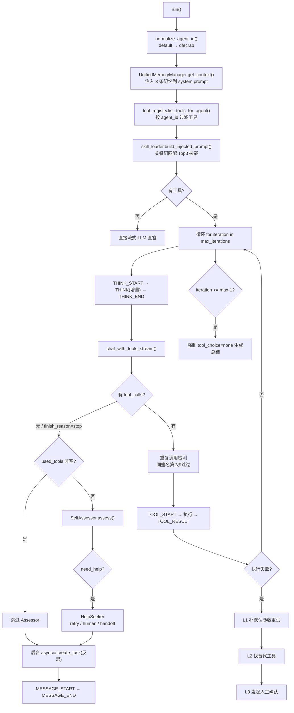
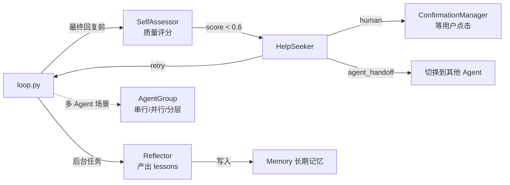

# 02.1 · `src/agent/` — Agent 与 LLM

> 覆盖范围：`src/agent/` **17 个 .py，共 4665 行**
> 分层：L3 编排层。这是整个系统「思考」的地方——意图识别 → 规划 → ReAct 循环 → 自我评估 → 求助 → 反思。
>
> 上一页：[02.0-根与core.config.utils.md](./02.0-根与core.config.utils.md)　｜　下一页：[02.2-gateway网关层.md](./02.2-gateway网关层.md)

---

## 0. 目录结构与数据流

```
src/agent/
├── __init__.py          懒加载导出 ReActLoop / TaskPlanner
├── agent_config.py      AgentConfig：三层配置合并（全局默认 → agent 级 → tools.json）
├── intent_classifier.py 意图识别 chat / task / complex
├── loop.py              ★ ReAct 循环（656 行，本目录核心）
├── planner.py           TaskPlanner：LLM 判断是否需要拆步骤
├── llm/                 LLM 适配层（6 个文件）
│   ├── adapter.py       ★ LLMAdapter（696 行），纯 httpx，不依赖 LangChain
│   ├── think.py         思考标签解析（<think> 等）
│   ├── service.py       LLMService / LegacyLLMService 兼容层
│   ├── fallback.py      ⚠️ STUB（15 行，空实现）
│   ├── retry.py         ⚠️ STUB（30 行，空实现）
│   └── __init__.py      懒加载导出
└── multi/               多智能体与自我改进（5 个文件）
    ├── agent_group.py   AgentGroup 编排器：串行 / 并行 / 分层
    ├── assessor.py      SelfAssessor：回复质量自评
    ├── confirmation.py  ConfirmationManager：高风险操作人工确认
    ├── help_seeker.py   HelpSeeker：retry / human / agent_handoff
    └── reflector.py     Reflector：执行后反思，产出教训与改进
```

**`loop.py` 的完整执行流（这是理解全系统的关键）：**



---

## 1. 本组文件一览

| 文件 | 行数 | 类型 | 一句话职责 |
|---|---|---|---|
| `__init__.py` | 34 | 兼容壳 | 懒加载导出 `ReActLoop` / `TaskPlanner` / `Plan` |
| `agent_config.py` | 335 | 配置 | `AgentConfig`：三层合并 + ID 归一化 |
| `intent_classifier.py` | 228 | 核心逻辑 | `IntentClassifier`：chat / task / complex |
| `loop.py` | **656** | **核心逻辑** | `ReActLoop`：ReAct 循环 + 三级自愈 + 超时兜底 |
| `planner.py` | 247 | 核心逻辑 | `TaskPlanner`：拆步骤 + 步骤状态机 |
| `llm/adapter.py` | **696** | **适配器** | `LLMAdapter`：OpenAI 兼容接口，纯 httpx |
| `llm/think.py` | 316 | 工具类 | `<think>` 标签解析、CoT 剥离 |
| `llm/service.py` | 121 | 兼容壳 | `LLMService` / `LegacyLLMService` |
| `llm/fallback.py` | **15** | **STUB** | `ModelFallbackManager` 空实现 |
| `llm/retry.py` | **30** | **STUB** | `RetryManager` 空实现 |
| `llm/__init__.py` | 82 | 兼容壳 | 懒加载导出 5 组符号 |
| `multi/agent_group.py` | 521 | 核心逻辑 | `AgentGroup`：串行 / 并行 / 分层编排 |
| `multi/assessor.py` | 381 | 核心逻辑 | `SelfAssessor`：规则快检 + LLM 深评 |
| `multi/confirmation.py` | 301 | 核心逻辑 | `ConfirmationManager`：人工确认 + asyncio.Event 唤醒 |
| `multi/help_seeker.py` | 353 | 核心逻辑 | `HelpSeeker`：retry / human / agent_handoff |
| `multi/reflector.py` | 326 | 核心逻辑 | `Reflector`：反思，产出 lessons / improvements |
| `multi/__init__.py` | 23 | 兼容壳 | 导出 confirmation / help_seeker / assessor 三组 |

---

## 2. 核心文件详解

### 2.1 `agent/loop.py`　★ 本目录最重要

| 项 | 内容 |
|---|---|
| 类型 | 核心逻辑 · ReAct 循环 |
| 规模 | 656 行 / 1 类 / 8 方法 |
| 职责 | **执行 LLM 驱动的「思考 → 调工具 → 观察」循环**，是 Agent 能力的唯一出口 |
| 核心符号 | `ReActLoop`（`run()` / `_assess_response()` / `_persist_memory()` / `_reflect_in_background()` / `_extract_user_text()` / `_merge_system_prompts()`）、`run_react_loop()` |
| 被调用方 | `src/gateway/grpc_server.py`、`src/skill/alert_react_pipeline.py`、`tests/` |
| 依赖 | `src.skill.registry.ToolRegistry`、`src.skill.loader.SkillLoader`、`src.agent.llm.adapter.LLMAdapter`、`src.core.event_types`、`src.agent.multi.*`（全部为函数内延迟 import） |
| 关联文件 | `agents/{id}/config.json`（skills_whitelist）、`config/dfecrab.json`（agent_defaults） |

**关键行为（非常规部分）：**

| 机制 | 位置 | 说明 |
|---|---|---|
| **120 秒总超时** | `async with asyncio.timeout(120)` | 防死循环安全网；32B 模型单轮可达 40s |
| **重复工具调用检测** | `_called_tool_signatures` | 同一工具 + 同一参数（`json.dumps(sort_keys=True)`）第 2 次直接跳过，并追加提示让 LLM 基于已有结果回复 |
| **三级自愈** | L1 / L2 / L3 | L1：从 `get_tool_defaults()` 补缺失默认参数重试；L2：`find_alternative_tool()` 找替代工具；L3：发 `CONFIRMATION` 事件等人工决策（30s 超时） |
| **强制 final** | `iteration >= max_iterations - 1` | 达到上限时以 `tool_choice="none"` 再调一次 LLM 强制生成总结 |
| **超时兜底** | `except asyncio.TimeoutError` | 同样以 `tool_choice="none"` 生成总结 |
| **Assessor 短路** | `used_tools` 非空 | 已成功调过工具 → **跳过 SelfAssessor**，省一次 LLM 调用 |
| **反思后台化** | `asyncio.create_task(self._reflect_in_background(...))` | 反思不再阻塞 `message_end`。注释明示原因：同步 await 会挤占 60s 超时窗口，导致 message_end 延迟 20s+ |
| **记忆注入** | `UnifiedMemoryManager.get_context(max_memories=3)` | 取 3 条相关记忆前置到 system prompt |
| **记忆沉淀** | `asyncio.create_task(self._persist_memory(...))` | fire-and-forget，失败静默 |
| **MCP 工具放行** | `enabled_skills` 过滤逻辑 | MCP 工具**不受** `enabled_skills` 白名单约束（注释标注「★修 BUG-1」），只按服务级白名单过滤 |
| **工具进度提示** | `tc_name in ("weather","web_fetch","excel_read")` | 三个慢工具先发 `TOOL_PROGRESS` 事件 |

| 备注 | ① 模块 docstring 的文件名写的是 `react_loop.py`，实际文件是 `loop.py`；② `run_react_loop()` 便捷函数的 `max_iterations` 默认是 **5**，而 `ReActLoop.__init__` 是 **3**、`AgentConfig` 也是 **3**——**代码层三处兜底值不一致**；但按 `AgentConfig` 的三层合并规则，`config/dfecrab.json` 的 `agent_defaults.max_iterations = 10` 会覆盖它们，**实际生效值是 10**（且 `agents/*/config.json` 均未再覆盖）；③ `plan_created` 事件在 `loop.py` 内是**注释掉的**（第 259–267 行），Planner 实际由 `grpc_server.py` 在外部调度 |

---

### 2.2 `agent/agent_config.py`

| 项 | 内容 |
|---|---|
| 类型 | 配置 |
| 规模 | 335 行 / 1 dataclass / 7 函数 |
| 职责 | 统一读取 Agent 配置，替代原先散落各处的 `open(config.json)` |
| 核心符号 | `AgentConfig`（dataclass）、`AgentConfig.from_id()`、`.list_agents()`、`.has_skills()`、`.is_tool_required()`、`.to_dict()`、`normalize_agent_id()`、`get_agent_config()`、`list_agents()` |
| 被调用方 | `src/agent/loop.py`、`src/agent/multi/agent_group.py`、`src/gateway/grpc_server.py`、`src/skill/registry.py` |
| 依赖 | 仅标准库 |

**三层配置合并（优先级从低到高）：**

1. `_DEFAULT_CONFIG`（代码内硬编码）：`model_name="Qwen3-14B-HGY"`、`max_iterations=3`、`tool_choice="auto"`、`memory_scope="session"`
2. `config/dfecrab.json` 的 `agent_defaults` 节点
3. `agents/{agent_id}/config.json` 的同名字段
4. **`agents/{agent_id}/tools.json` 的 `enabled_skills` —— 最高优先级**（UI 勾选落盘源）

**关键行为：**
- `skills_whitelist` 三态：`None`=加载全部、`[]`=不加载任何、`["a","b"]`=只加载指定
- `config.json` 内的 `skills_whitelist` 标记为 `deprecated`，优先级低于 `tools.json`
- **ID 兼容映射**：`_AGENT_ID_ALIASES = {"default": "dfecrab"}`，命中时打印 deprecation 警告。用于兼容已持久化的会话、旧 API 调用、ZK 服务类型
- 任何一级读取失败**都不抛异常**，降级到上一级

| 备注 | ① 模块级 `_default_config` 全局变量已声明但 `get_agent_config()` 根本没用它（注释写「简单实现：每次都重新读取」）→ **死变量**；② `_get_project_root()` 用 `parent.parent.parent` 硬算路径，与 `src/__init__.py` 的 `PROJECT_ROOT` 重复实现 |

---

### 2.3 `agent/intent_classifier.py`

| 项 | 内容 |
|---|---|
| 类型 | 核心逻辑 · 分类器 |
| 规模 | 228 行 / 1 类 / 6 方法 |
| 职责 | 将用户消息分为 `chat`（直答）/ `task`（ReAct）/ `complex`（Planner）三类 |
| 核心符号 | `IntentClassifier.classify()`、`._rule_classify()`、`._llm_classify()`、`get_intent_classifier()`（单例） |
| 被调用方 | `src/agent/loop.py`、`src/gateway/handlers/agent_handler.py`、`src/gateway/grpc_server.py` |
| 依赖 | `src.agent.llm.adapter.LLMAdapter`（函数内延迟 import） |

**关键行为：**
1. `has_skills=False`（Agent 未配置任何技能）→ **直接返回 `chat`**，不做 LLM 调用
2. LLM 分类带 **3 秒超时**；超时 / 异常 / 空响应 → 降级到 `_rule_classify()`
3. 规则分类的 patterns 由构造参数注入；**类内默认值为空列表**——注释明确写了「历史硬编码已迁移到 `agents/manager_agent/config.json` 的 `intent_patterns` 字段」

| 备注 | ① docstring 仍写「LLM 模式（可选）」，实际已是默认路径，文档滞后；② **改意图识别规则要改 `agents/manager_agent/config.json`，不是改这个 Python 文件** |

---

### 2.4 `agent/planner.py`　⚠️ 存在调用方崩溃风险

| 项 | 内容 |
|---|---|
| 类型 | 核心逻辑 · 任务规划 |
| 规模 | 247 行 / 3 类 / 21 方法 |
| 职责 | 让 LLM 判断任务是否需要拆成多步；维护计划与步骤状态机 |
| 核心符号 | `PlanStep`、`Plan`（`total` / `completed` / `percent` / `get_current_step()`）、`TaskPlanner`、`get_task_planner()` |
| 被调用方 | `src/gateway/grpc_server.py:2682`、`src/gateway/plan_router.py`、`src/gateway/handlers/plan_handler.py`、`src/gateway/legacy.py:870` |
| 依赖 | 仅标准库 + 注入的 `llm_adapter` |

**`TaskPlanner` 的真实方法清单（共 19 个）：**

`__init__` / `plan` / `get_current_plan` / `get_current_step` / `get_all_plans` / `cancel_plan` / `get_progress` / `format_plan_summary` / `complete_step` / `skip_step` / `fail_step` / `start_step` / `set_step_result` / `get_step_result` / `get_all_step_results` / `clear_step_results`

> ### 🔴 已确认：`create_plan()` 不存在
>
> `TaskPlanner` **没有 `create_plan` 方法**，但有两处调用它：
>
> | 调用方 | 行号 | 后果 |
> |---|---|---|
> | `skills/planner/execute.py` | 221 | `planner.create_plan(task, plan_data["steps"], complexity)` → `AttributeError` |
> | `plugins/planner/execute.py` | 221 | 同上 |
>
> 另有 `tests/test_multi_agent_collaboration.py:120` 写 `TaskPlanner(registry)`，而 `__init__(self)` **不接受任何参数** → `TypeError`。
>
> **结论：planner 技能的「保存计划到跟踪器」路径必崩；多智能体协作测试也跑不起来。** 详见 `09-冗余重复专项报告.md`。

**关键行为：** `plan()` 让 LLM 返回 `{"steps":[{"description":..., "suggested_tool":...}]}`；`{"steps":[]}` 表示不需要拆分。每步执行结果缓存在 `self._step_results[plan_id][step_index]`。

---

## 3. `src/agent/llm/` — LLM 适配层

| 项 | 内容 |
|---|---|
| **定位** | 所有对 LLM 的调用都收敛到这里 |
| **规模** | 6 个 .py，共 1260 行 |
| **关键约定** | **纯 `httpx` 实现，不依赖 LangChain**（docstring 明示「避免依赖冲突」） |
| **重要提醒** | 其中 `fallback.py` 与 `retry.py` **是空壳 STUB**，详见下方红色警示 |

### 3.1 `llm/adapter.py`　★ 最重要的 LLM 出口

| 项 | 内容 |
|---|---|
| 类型 | 适配器 |
| 规模 | 696 行 / 2 类 / 10 方法 |
| 职责 | 封装 OpenAI 兼容接口，提供同步/流式、带工具/不带工具四种调用形态 |
| 核心符号 | `LLMAdapter`（`call` / `call_stream` / `call_with_reasoning` / `chat_with_tools` / `chat_with_tools_stream` / `_get_client` / `_build_headers` / `_build_payload`）、`LLMAdapterManager`（`call_with_fallback` / `get_stream_adapter`） |
| 被调用方 | `src/agent/loop.py`、`src/agent/planner.py`、`src/agent/multi/*`、`src/gateway/`、`services/`、各类 skill |
| 依赖 | `httpx`（函数内延迟 import）、`src.agent.llm.think` |

**四种调用形态：**

| 方法 | 流式 | 工具 | 返回 / 产出事件 |
|---|---|---|---|
| `call()` | ❌ | ❌ | `str` |
| `call_stream()` | ✅ | ❌ | `{"type": "reasoning"/"token"/"done"/"error"}` |
| `chat_with_tools()` | ❌ | ✅ | `{"content","tool_calls","finish_reason"}` |
| `chat_with_tools_stream()` | ✅ | ✅ | `{"type": "think"/"token"/"tool_calls"/"done"}` |

**关键行为：**
- **v4.0 起 `thinking` 事件改名为 `think`**（`chat_with_tools_stream` 的 docstring 明确标注）
- `api_key == "not-needed"` 时不发 `Authorization` 头
- `no_think=True` 时**追加一条 `{"role":"user","content":"/no_think"}` 消息**来关闭 Qwen3 深度思考；注释说明用副本避免污染调用方消息
- `LLMAdapterManager` 从 `config/dfecrab.json` 读 `model`（主）+ `model_providers`（备），`call_with_fallback()` 依次尝试

| 备注 | ⚠️ **连接池只在部分方法生效**：`_get_client()`（第 73 行）实现了懒加载复用（`max_connections=50`），但只有 `call()`（143 行）和 `call_stream()`（211 行）用了它；**`chat_with_tools()`（418 行）和 `chat_with_tools_stream()`（513 行）每次都 `async with httpx.AsyncClient(...)` 新建连接**。而 ReAct 主路径走的正是后者——连接池优化对主路径无效 |

### 3.2 `llm/think.py`

| 项 | 内容 |
|---|---|
| 类型 | 工具类 · 标签解析 |
| 规模 | 316 行 / 8 函数 |
| 职责 | 解析并剥离模型的思考内容（`<think>` / `<reasoning>` 等标签） |
| 核心符号 | `get_default_think_config()`、`get_think_config_for_model()`、`remove_think_tags()`、`extract_think_content()`、`strip_cot()`、`find_first_tag_position()`、`check_split_tag()`、`extract_thinking_and_content()` |
| 被调用方 | `src/agent/llm/adapter.py:33`（导入 4 个函数）、`src/agent/llm/__init__.py` |
| 关键行为 | 思考配置**按模型名匹配**（`get_think_config_for_model`），并从 `config/gateway.yaml` 的 `think_config` 读全局配置（`src/agent/llm/think.py:47` 延迟 import `config_loader`）；`extract_thinking_and_content()` 是 v4.0 新增，用于「分离但保留思考」而非删除 |
| 备注 | `strip_cot()` 内部有 60 行注释解释 CoT 剥离策略，说明这块踩过不少坑 |

### 3.3 `llm/service.py`

| 项 | 内容 |
|---|---|
| 类型 | 兼容壳 |
| 规模 | 121 行 / 2 类 |
| 职责 | 为迁移到 `LLMAdapter` 提供过渡接口 |
| 核心符号 | `LLMService`（`call` / `call_stream` / `call_with_reasoning`）、`LegacyLLMService`（`_call_llm` / `_call_llm_async` / `_call_llm_async_stream`） |
| 被调用方 | 未在 `src/` 内检索到调用方（`__init__.py` 有导出） |
| 关键行为 | `call_stream()` 把 adapter 的事件格式 **转换回旧格式** `{"token":..., "reasoning":...}`，供老代码消费 |
| 备注 | docstring 自称「过渡层，后续可逐步替换」，但当前 `src/` 内已无消费者 → 疑似可清理 |

---

### 🔴 3.4 `llm/fallback.py` — 空壳 STUB（15 行）

| 项 | 内容 |
|---|---|
| 类型 | **STUB** |
| 规模 | 15 行 / 3 个类函数对象 |
| 职责 | 名义上的「模型降级管理器」，**实际全是空实现** |

```python
class ModelFallbackManager:
    async def status(self): return {"status": "ok"}
    def record_failure(self, *a, **kw): pass
    def record_success(self, *a, **kw): pass
    def get_current_model(self, *a, **kw): return {"name": "google/gemma-4-26b-a4b"}
    def get_fallback_provider(self): return None
    def get_fallback_chain(self): return []
    async def switch_model(self, *a, **kw): return True
```

| 风险 | 说明 |
|---|---|
| **降级能力实际不存在** | `get_fallback_provider()` 恒返回 `None`、`get_fallback_chain()` 恒返回 `[]`、`switch_model()` 恒返回 `True`（无论成功失败） |
| **返回了不存在的模型名** | `get_current_model()` 硬编码返回 `google/gemma-4-26b-a4b`——**`gemma-4` 这个模型根本不存在**（Google 目前只有 `gemma-3` 系列），这是一个凭空编造的占位值 |
| **静默假成功** | 调用方无法通过返回值判断降级是否真的生效 |

> 该文件被 `src/agent/llm/__init__.py` 正式导出（`ModelFallbackManager`、`FallbackHandler`、`get_fallback_manager`），**任何依赖它的代码都会拿到假结果**。

---

### 🔴 3.5 `llm/retry.py` — 空壳 STUB（30 行）

| 项 | 内容 |
|---|---|
| 类型 | **STUB** |
| 规模 | 30 行 / 2 类 |
| 职责 | 名义上的「重试管理器」，**实际实现有严重缺陷** |

```python
class RetryConfig:
    def __init__(self, attempts=3, min_delay_ms=500, max_delay_ms=10000,
                 jitter=0.1, should_retry=None, **kw):
        self.attempts = attempts
        self.should_retry = should_retry   # ← 其余 4 个参数全部丢弃

class RetryManager:
    async def execute(self, fn, *a, **kw):
        try:
            return await fn(*a, **kw)
        except:                            # ← 裸 except
            return None                    # ← 静默吞掉后返回 None
```

| 风险 | 说明 |
|---|---|
| **参数静默丢弃** | `min_delay_ms` / `max_delay_ms` / `jitter` 三个参数被接收后**完全不使用**，退避策略与抖动都不存在 |
| **裸 `except:`** | 会捕获 `KeyboardInterrupt` / `SystemExit`，且**异常被完全吞掉**——调用方无法感知失败原因，只拿到 `None` |
| **重试间隔写死** | `execute_with_retry()` 里是 `await asyncio.sleep(0.1)` 固定 100ms，与 `RetryConfig` 配置无关 |
| **重试次数写死** | 循环里 `if i < 2` 硬编码，与 `attempts` 无关（除非 `attempts` < 3 才生效） |

> 同样被 `src/agent/llm/__init__.py` 正式导出（`RetryConfig`、`RetryManager`、`get_retry_manager`）。

---

## 4. `src/agent/multi/` — 多智能体与自我改进

| 项 | 内容 |
|---|---|
| **定位** | 「让 Agent 自己变好」的五个组件：编排、自评、求助、确认、反思 |
| **规模** | 5 个 .py，共 1882 行 |
| **关键约定** | 全部采用**模块级单例 + `get_xxx()` 访问器 + `reset_xxx()` 重置器**模式，便于测试隔离 |
| **依赖方向** | 只有 `agent_group.py` 顶层 import 了 `src.agent.agent_config`；其余全部零内部依赖，`loop.py` 通过函数内延迟 import 使用它们 |

**五个组件的协作关系：**



### 4.1 `multi/agent_group.py`

| 项 | 内容 |
|---|---|
| 类型 | 核心逻辑 · 编排器 |
| 规模 | 521 行 / 2 枚举 + 2 dataclass + 1 类 / 9 方法 |
| 职责 | 多 Agent 编排：**串行**（A→B→C，前一输出作后一输入）、**并行**（A+B 同时跑后合并）、**分层**（Manager 决策分发给 Worker） |
| 核心符号 | `OrchestrationMode`（SEQUENTIAL / PARALLEL / HIERARCHICAL）、`AgentTask`、`OrchestrationResult`、`AgentGroup`（`run` / `_run_sequential` / `_run_parallel` / `_run_hierarchical` / `_run_single_agent` / `_parse_manager_assignments`）、`get_agent_group()` / `reset_agent_group()` |
| 被调用方 | `src/gateway/grpc_server.py`（多 Agent 场景） |
| 依赖 | `src.agent.agent_config.AgentConfig`（顶层唯一 import） |
| 关键行为 | docstring 明示「**每步内部仍走 ReActLoop**」——即本组件只做调度，执行仍复用 `loop.py`；`_parse_manager_assignments()` 负责解析 Manager 的分派输出 |
| 备注 | 注意区分：本文件是 `src/agent/multi/agent_group.py`（编排器），而 `src/task/agent_group.py` 是另一个同名概念（任务维度的 Agent 组），两者不是一回事 |

### 4.2 `multi/assessor.py`

| 项 | 内容 |
|---|---|
| 类型 | 核心逻辑 · 自我评估 |
| 规模 | 381 行 / 2 枚举 + 1 dataclass + 1 类 / 6 方法 |
| 职责 | 在 ReAct 生成 final 前评估回复质量，决定是否需要求助 |
| 核心符号 | `TaskType`、`AssessmentStatus`、`Assessment`（`.needs_help` / `.to_dict()`）、`SelfAssessor`（`assess` / `_rule_check` / `_llm_assess` / `_is_trivial`）、`get_self_assessor()` |
| 被调用方 | `src/agent/loop.py:105`（`_assess_response` 内延迟 import） |
| 依赖 | 注入的 `llm_adapter` |
| 关键行为 | ① **两级评估**：规则快检（0 延迟）分数够高直接通过 → 不够才触发 LLM 深度评估；② **阈值 0.6**：`quality_score >= 0.6` 通过，`< 0.6` 置 `need_help=True`；③ `_is_trivial()` 识别「无需评估」的简单回复（如纯问候）以省 LLM 调用；④ 异常时降级返回 `Assessment(quality_score=0.6, quality_level="medium", status=SKIPPED)` |
| 备注 | `loop.py` 中若 `used_tools` 非空会**完全跳过** Assessor |

### 4.3 `multi/confirmation.py`

| 项 | 内容 |
|---|---|
| 类型 | 核心逻辑 · 人机交互 |
| 规模 | 301 行 / 1 枚举 + 1 dataclass + 1 类 / 10 方法 |
| 职责 | 高风险操作前的人工确认：挂起 ReAct 循环，等前端回执后唤醒 |
| 核心符号 | `ConfirmStatus`、`ConfirmationRequest`、`ConfirmationManager`（`add` / `get` / `get_by_id` / `list_pending` / `remove` / `resume` / `check_timeouts` / `wait_for_response` / `get_history`）、`get_confirmation_manager()` |
| 被调用方 | `src/agent/loop.py:37`（顶层 import `ConfirmStatus`）、`loop.py:535`（L3 自愈时延迟 import）、`src/gateway/handlers/`（`/api/confirm/response` 端点） |
| 依赖 | `asyncio.Event` |
| 关键行为 | **六步闭环**（docstring 明确列出）：loop 发 CONFIRMATION 事件 → gateway 透传 → 前端弹窗 → 前端 POST `/api/confirm/response` → `resume()` 唤醒 `asyncio.Event` → loop 继续或跳过；`wait_for_response()` 带超时，`check_timeouts()` 清理过期请求 |
| 备注 | docstring 说明与旧版区别：**旧版仅用于 multi-agent 求助确认，新版是通用确认**（如删除文件、批量操作） |

### 4.4 `multi/help_seeker.py`

| 项 | 内容 |
|---|---|
| 类型 | 核心逻辑 · 求助 |
| 规模 | 353 行 / 2 枚举 + 2 dataclass + 1 类 / 8 方法 |
| 职责 | SelfAssessor 判定需求助后，按 `help_type` 执行三种策略 |
| 核心符号 | `HelpType`（RETRY / HUMAN / AGENT_HANDOFF）、`HelpStatus`、`HelpRequest`、`HelpResponse`、`HelpSeeker`（`seek_help` / `_handle_retry` / `_handle_human` / `_handle_agent_handoff` / `seek_help_chain`）、`get_help_seeker()` |
| 被调用方 | `src/agent/loop.py:362`（Assessor 不通过时延迟 import） |
| 依赖 | 注入的 `llm_adapter` |

**三种求助策略：**

| 策略 | 行为 | loop.py 中的处理 |
|---|---|---|
| `retry` | 给 LLM 追加「再试一次」提示 | 把 `help_response.content` 作为 user 消息追加，`continue` 进入下一轮 |
| `human` | 需要人工介入 | yield `CONFIRMATION` 事件（选项「提供更多信息」/「跳过」，60s），然后 `break` |
| `agent_handoff` | 切换到另一个 Agent | yield `MESSAGE_END` 并附 `handoff_agent` 字段，然后 `return` |

| 备注 | `seek_help_chain()` 是为兼容 `legacy.py` 保留的链式多 Agent 协作接口 |

### 4.5 `multi/reflector.py`

| 项 | 内容 |
|---|---|
| 类型 | 核心逻辑 · 反思 |
| 规模 | 326 行 / 1 dataclass + 1 类 / 5 方法 |
| 职责 | ReAct 结束后对执行过程结构化反思，产出经验教训 |
| 核心符号 | `ReflectionResult`（`.lessons` / `.score` / `.improvements` / `.to_prompt_text()`）、`Reflector`（`reflect` / `_quick_score` / `_rule_lessons` / `_llm_reflect`）、`get_reflector()` |
| 被调用方 | `src/agent/loop.py:620`（`_reflect_in_background` 内延迟 import） |
| 依赖 | 注入的 `llm_adapter`；结果写入 `src.memory.long_term.MemoryManager` |
| 关键行为 | ① 产出 `lessons`（本次教训）与 `improvements`（下次建议），由 `loop.py` 写入长期记忆，下一轮通过 system_prompt 回注；② `_quick_score()` 快速打分、`_rule_lessons()` 规则生成教训，只有需要时才走 `_llm_reflect()`；③ 整个调用包在 `try/except` 内，**失败静默**（`logger.debug`） |
| 备注 | 反思是**旁路任务**，`loop.py` 明确注释「用户无感知；慢模型下不会挤占对话超时窗口」 |

---

## 5. 本组发现汇总

| # | 级别 | 发现 | 位置 |
|---|---|---|---|
| 27 | 🔴 P0 | **`TaskPlanner.create_plan()` 不存在**，但 `skills/planner` 与 `plugins/planner` 都在调用 → `AttributeError` 必崩 | `src/agent/planner.py` vs `skills|plugins/planner/execute.py:221` |
| 28 | 🔴 P0 | `tests/test_multi_agent_collaboration.py:120` 用 `TaskPlanner(registry)`，但 `__init__(self)` 无参数 → `TypeError`，测试跑不起来 | — |
| 29 | 🔴 P0 | **`llm/fallback.py` 是空壳 STUB**：降级链恒为空、`switch_model` 恒返回 True、且硬编码返回**不存在的模型名** `google/gemma-4-26b-a4b` | `src/agent/llm/fallback.py` |
| 30 | 🔴 P0 | **`llm/retry.py` 是空壳 STUB**：退避/抖动参数被丢弃、裸 `except` 吞异常返回 None、重试间隔与次数写死 | `src/agent/llm/retry.py` |
| 31 | 🟠 P1 | **连接池优化对主路径无效**：`chat_with_tools` / `chat_with_tools_stream`（ReAct 主路径）未使用 `_get_client()`，每次新建 httpx 连接 | `src/agent/llm/adapter.py:418, 513` |
| 32 | 🟡 P2 | **`max_iterations` 代码层三处兜底值不一致**（`ReActLoop.__init__`=3、`run_react_loop()`=5、`AgentConfig`=3），但**配置层统一覆盖为 10**（`config/dfecrab.json` 的 `agent_defaults`），实际生效 10。代码兜底值仅在配置文件缺失时才有意义 | — |
| 33 | 🟠 P1 | **Planner 未接入 `loop.py`**：`plan_created` 事件在 `loop.py:259-267` 是注释掉的，实际由 `grpc_server.py:2681` 在外部调度 | `src/agent/loop.py` |
| 34 | 🟡 P2 | `agent_config.py` 的模块级 `_default_config` 全局变量**已声明但从未使用** | `src/agent/agent_config.py:312` |
| 35 | 🟡 P2 | `_get_project_root()` 用 `parent.parent.parent` 硬算路径，与 `src/__init__.py` 的 `PROJECT_ROOT` 重复实现 | `src/agent/agent_config.py:37` |
| 36 | 🟡 P2 | `llm/service.py`（`LLMService` / `LegacyLLMService`）自称过渡层，但 `src/` 内已无消费者 | — |
| 37 | 🟡 P2 | `loop.py` 模块 docstring 写的文件名是 `react_loop.py`，与实际文件名 `loop.py` 不符 | `src/agent/loop.py:2` |
| 38 | ℹ️ 澄清 | `src/agent/multi/agent_group.py`（编排器）与 `src/task/agent_group.py`（任务 Agent 组）**同名不同物** | — |

---

<div align="center">

**02.1 · agent 与 LLM 完**　（17 / 17 个文件，4665 行）

上一页：[02.0-根与core.config.utils.md](./02.0-根与core.config.utils.md)　｜　下一页：[02.2-gateway网关层.md](./02.2-gateway网关层.md)

</div>