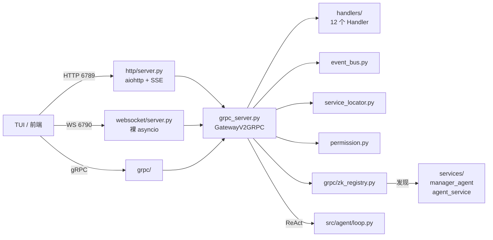

# 02.2 · `src/gateway/` — 网关层

> 覆盖范围：**31 个 .py，共 12917 行**（另含 1 个 `.proto`、1 个 `.html`）
> 分层：L2 接入层。这是整个系统**最大的目录**，也是对外唯一的协议入口。
>
> ⚠️ **规模警示**：`grpc_server.py` 单文件 5504 行、含 96 个方法，是本项目最需要拆分的文件。
>
> 上一页：[02.1-agent与LLM.md](./02.1-agent与LLM.md)　｜　下一页：[02.3-memory与session.md](./02.3-memory与session.md)

---

## 0. 目录结构与职责

```
src/gateway/
├── grpc_server.py        ★ 5504 行 · GatewayV2GRPC 主类（96 方法）
├── legacy.py             ⚠ 2491 行 · 旧版插件化 Gateway（仅 --mode plugin 时启用）
├── event_bus.py          299 行 · 事件总线 + ⚠ 重复定义 ReactEventType
├── service_locator.py    298 行 · 服务注册与依赖检查
├── plan_router.py        272 行 · 计划进度/取消/步骤的路由函数集
├── session_handler.py    122 行 · 会话服务（HTTP/WS 共用，协议无关）
├── user_service.py        96 行 · 用户 CRUD（改 config/permissions.json）
├── permission.py          77 行 · 权限判定（功能权限 × 数据范围）
├── __init__.py            25 行 · 懒加载导出 EventBus / ServiceLocator
│
├── grpc/                 gRPC 与 ZK（5 个 .py + 1 个 .proto）
│   ├── zk_registry.py        270 · Zookeeper 服务注册与发现
│   ├── dfecrab_pb2_grpc.py   303 · 生成的 gRPC 存根
│   ├── dfecrab_pb2.py         66 · 生成的消息定义
│   ├── port_allocator.py     119 · 端口分配
│   ├── dfecrab.proto         113 · 协议定义
│   └── __init__.py             9
│
├── handlers/             HTTP 请求处理器（12 个 .py）
│   ├── mcp_handler.py         526 · MCP 服务管理
│   ├── memory_handler.py      428 · 记忆管理
│   ├── skill_handler.py       365 · 技能管理
│   ├── multi_agent_handler.py 320 · 多智能体
│   ├── task_v2_handler.py     259 · 任务 V2
│   ├── model_handler.py       177 · 模型管理
│   ├── plan_handler.py        134 · 计划
│   ├── events_handler.py       94 · 事件流
│   ├── session_handler.py      64 · 会话（薄封装）
│   ├── fallback_handler.py     58 · ⚠ 降级（假实现）
│   ├── agent_handler.py        52 · Agent CRUD
│   └── __init__.py             51 · 懒加载映射
│
├── websocket/            WebSocket（3 个 .py，共 879 行）
│   ├── connection.py     523 · 连接管理 + Token 认证
│   ├── server.py         338 · 裸 asyncio WebSocket 服务端
│   └── __init__.py        18
│
├── http/                 HTTP（2 个 .py，共 559 行）
│   ├── server.py         542 · aiohttp 服务端 + SSE 流式
│   └── __init__.py        17
│
└── static/
    └── mcp_admin.html    440 · MCP 管理页面
```

**架构示意：**



---

## 1. 主文件详解

### 1.1 `gateway/grpc_server.py`　★ 全项目最大文件

| 项 | 内容 |
|---|---|
| 类型 | 核心逻辑 · 网关主体 |
| 规模 | **5504 行** / 2 个类（`SSEStreamingResponse` 35 行 + `GatewayV2GRPC` **5305 行**）/ 96 个方法 |
| 职责 | V2 版网关主体：对外提供 HTTP(6789) / WebSocket(6790) / SSE，对内通过 Zookeeper 做服务发现并以 gRPC 客户端身份调用 Manager Agent 与 Worker Agents；承载「意图编排 → ReAct 执行 → 流式事件回传 → 会话持久化」完整链路，同时托管 Agent 进程生命周期与全部管理类 REST API |
| 核心符号 | `GatewayV2GRPC`（`__init__` / `start` / `stop` / `_react_chat_generator` / `_setup_routes` / 90+ 个业务与路由方法）、`SSEStreamingResponse`、`_strip_think_tags()` |
| 被调用方 | `scripts/start_gateway_grpc.py`、`src/__main__.py`、`scripts/check_system_health.py` |
| 关联文件 | `src/core/errors.py`（注册全局异常处理）、`src/config/config_loader.py`、`src/gateway/grpc/zk_registry.py`、`src/agent/planner.py` |

**文件头 docstring 自述的链路：**

```
用户 → HTTP(6789) / WebSocket(6790) → Gateway → gRPC → Manager(随机端口) → Zookeeper(2181) → Workers(随机端口)
```

**关键位置（已核实行号）：**

| 行号 | 内容 |
|---|---|
| 1–13 | 模块 docstring，描述整体链路 |
| 52 | `from src.core.errors import error_response, setup_global_exception_handlers, setup_asyncio_exception_handler, UserError` |
| 165–199 | `SSEStreamingResponse` 类：SSE 流式响应壳，持有 async generator，由 `http/server.py` 的 `_handle_sse_streaming` 识别迭代 |
| 200–5504 | `GatewayV2GRPC` 主类 |
| 1094–1095 | `setup_global_exception_handlers()` + `setup_asyncio_exception_handler()` 注册 |
| 1837 | `use_plan = (intent == "complex")` —— complex 意图在此决定是否走 Planner |
| 1847 | 把 `use_plan` 传给下游 |
| 204 | 延迟 import `config_loader` 取 host |
| 2068–2069 | 延迟 import `port_loader.knowledge_api_port` 取知识库端口 |
| 2546–2556 | `use_plan` 参数定义，注释标注「P1-7: use_plan=True 时先调 Planner 拆步骤，再逐步骤跑 ReAct」 |
| 2681–2684 | **实际调用 Planner 的位置**：`planner = get_task_planner(); plan = await planner.plan(...)` |
| 5202 | `/api/plugins` 系列接口，查询 `PluginRegistry` |

| 备注 | ① **`GatewayV2GRPC` 单类 5305 行、96 个方法，是本项目最严重的「上帝类」问题**，建议按 handlers/ 的模式拆分；② Planner 的调度**不在 `loop.py` 内**（那里是注释掉的），而是在本文件的 2681 行外部调用 |

---

### 1.2 `gateway/legacy.py`　⚠ 旧版 Gateway（2491 行）

| 项 | 内容 |
|---|---|
| 类型 | 核心逻辑 · **旧版** |
| 规模 | 2491 行 |
| 职责 | v3 时代的插件化 Gateway，无 WebSocket 支持 |
| 被调用方 | `src/__main__.py`（仅 `--mode plugin` 分支）、`src/agent/planner.py:870` 位置被引用 |
| 依赖 | `src.config.config` 的硬编码模型配置（`legacy.py:10`）、`src.agent.planner.get_task_planner`（`legacy.py:24`） |
| 关键行为 | 通过 `get_gateway()` 返回单例；`/api/fallback/*` 相关路由挂在这里 |

| 备注 | ① **这是全仓库唯一使用 `src/config/config.py`（含明文 API Key 那份配置）的地方**；② 生产路径（`dfecrab start`）走的是 `grpc_server.py`，**本文件在生产环境不生效**；③ 与 `grpc_server.py` 构成双套网关实现 |

---

### 1.3 `gateway/event_bus.py`

| 项 | 内容 |
|---|---|
| 类型 | 核心逻辑 · 事件总线 |
| 规模 | 299 行 / 3 枚举或类 / 12 方法 |
| 职责 | 基础设施事件与 ReAct 事件的发布订阅，支持事件历史 |
| 核心符号 | `EventType`（8 个基础设施事件）、`Event`、`EventBus`（`subscribe` / `unsubscribe` / `publish` / `subscribe_react` / `subscribe_all_react` / `publish_react` / `get_event_history` / `start` / `stop`）、`get_event_bus()` / `reset_event_bus()` |
| 被调用方 | `scripts/check_system_health.py:812`、`src/gateway/grpc_server.py` |
| 依赖 | 仅标准库 |

> ### 🔴 已确认：事件协议分裂
>
> **本项目有两份 `ReactEventType` 枚举，且内容不一致：**
>
> | 定义位置 | 成员 | 状态 |
> |---|---|---|
> | `src/core/event_types.py:27` | `THINK_START` / `THINK` / `THINK_END` / `TOOL_START` / `TOOL_PROGRESS` / `TOOL_CALL` / `TOOL_RESULT` / `MESSAGE_START` / `MESSAGE_END` / `PLAN_CREATED` / `PLAN_STEP` / `ERROR` / `CONFIRMATION` / `SKILL_MATCH` 等 | **v4.0 现行版**，`src/agent/loop.py` 使用的就是它 |
> | `src/gateway/event_bus.py:32` | `THINKING` / `TOOL_CALL` / `TOOL_RESULT` / `PLAN_CREATED` / `PLAN_STEP` / `FINAL` / `ERROR` / `CONFIRMATION` | **旧版**，仍是 `THINKING` 与 `FINAL` |
>
> `event_bus.py:33` 的注释写着「与 `src/core/event_types.py` 对齐」，但实际上**并没有对齐**——它缺 `THINK_START`/`THINK_END`/`MESSAGE_END`/`TOOL_START`/`TOOL_PROGRESS`/`SKILL_MATCH`，且沿用了已被取代的 `THINKING` 与 `FINAL`。
>
> **后果**：任何通过 `event_bus` 监听 ReAct 事件的订阅者，都收不到 v4.0 的新事件类型。

---

### 1.4 `gateway/service_locator.py`

| 项 | 内容 |
|---|---|
| 类型 | 核心逻辑 · 服务定位 |
| 规模 | 298 行 / 2 类 / 11 方法 |
| 职责 | 服务注册与依赖检查，解决模块间循环依赖 |
| 核心符号 | `ServiceRegistration`、`ServiceLocator`（`__new__` 单例 / `register` / `unregister` / `get` / `has` / `list_services` / `get_metadata` / `check_dependencies` / `initialize_all`） |
| 被调用方 | `src/gateway/__init__.py` 导出；`src/gateway/grpc_server.py` |
| 关键行为 | 支持「依赖检查」——`check_dependencies()` 返回缺失依赖清单；`initialize_all()` 按依赖顺序初始化所有服务 |

### 1.5 `gateway/plan_router.py`

| 项 | 内容 |
|---|---|
| 类型 | 路由 |
| 规模 | 272 行 / 6 函数 |
| 职责 | 计划相关路由的函数集合 |
| 核心符号 | `handle_plan_progress`、`handle_plan_current`、`handle_plan_cancel`、`handle_plan_steps`、`handle_plan_step_execute`、`get_plan_routes()` |
| 依赖 | `src.agent.planner.get_task_planner`（第 18 行 import，在函数内 47/87/124/166/212 行各调一次） |
| 备注 | 与 `handlers/plan_handler.py` 存在职责重叠——两者都调 `get_task_planner()` 做计划操作，**是两套并存的计划接口** |

### 1.6 `gateway/permission.py`

| 项 | 内容 |
|---|---|
| 类型 | 核心逻辑 · 权限 |
| 规模 | 77 行 / 1 类 / 7 方法 |
| 职责 | 权限判定：功能权限（read / write）× 数据范围（all / own） |
| 核心符号 | `PermissionService`（`__new__` 单例 / `_load_config` / `reload` / `resolve_role` / `is_admin` / `has_access` / `data_scope_of` / `can_access_record`） |
| 被调用方 | `src/gateway/user_service.py:12`、`src/gateway/session_handler.py:12`、`src/gateway/handlers/` |
| 依赖 | `config/permissions.json`（用 `parent.parent.parent` 定位根目录） |
| 关键行为 | ① 未注册用户落到 `default_role`（默认 `guest`）；② `has_access` 中 `read` 对所有有角色的用户恒为 True，`write` 才校验 `level`；③ `can_access_record` 组合判定：`has_access` 通过 **且**（`data_scope == "all"` **或** `owner_id == user_id`） |
| 备注 | 权限模型只有 2 个等级（read/write）+ 2 个范围（all/own）+ 3 个角色（admin/user/guest），比较简单；`admin` 是唯一可操作系统的角色 |

### 1.7 `gateway/user_service.py`

| 项 | 内容 |
|---|---|
| 类型 | 服务 |
| 规模 | 96 行 / 1 类 / 6 静态方法 |
| 职责 | 用户 CRUD：读写 `config/permissions.json` 的 `users` 映射（账号 → 角色） |
| 核心符号 | `UserService`（`_read_config` / `_write_config` / `list_users` / `create_user` / `update_user` / `delete_user`）、`VALID_ROLES = ("admin","user","guest")` |
| 依赖 | `src.gateway.permission.PermissionService` |
| 关键行为 | 每次写配置后自动调用 `PermissionService().reload()`，**使权限变更立即生效**（无需重启） |
| 备注 | 用户数据直接存在 JSON 配置文件里，无数据库、无密码（仅账号名 + 角色），适用于内网可信环境 |

### 1.8 `gateway/session_handler.py`

| 项 | 内容 |
|---|---|
| 类型 | 服务 · 协议无关层 |
| 规模 | 122 行 / 1 类 |
| 职责 | 会话管理核心逻辑，供 HTTP 与 WebSocket **共用** |
| 核心符号 | `SessionService`（`list_sessions` 等） |
| 依赖 | `src.session.manager.get_session_manager`、`src.gateway.permission.PermissionService`、`src.utils.logger.get_logger`（延迟） |
| 关键行为 | `data_scope` 为 `all` 的用户传 `user_id=None`（看全部），否则传自己的 id（只看自己的）；`include_empty=False` 时过滤空会话 |

| 备注 | **设计亮点**：docstring 明确写了「每一行业务逻辑只写一份，HTTP/WS 只是协议适配层」——这是本项目少有的、有明确架构意图的抽象。同名文件 `handlers/session_handler.py`（64 行）是它在 HTTP 侧的薄封装 |

---

## 2. `grpc/` — gRPC 与服务发现

| 项 | 内容 |
|---|---|
| **定位** | gRPC 协议层与 Zookeeper 服务注册发现 |
| **规模** | 5 个 .py（767 行）+ 1 个 .proto（113 行） |

### 2.1 `grpc/zk_registry.py`

| 项 | 内容 |
|---|---|
| 类型 | 核心逻辑 · 服务发现 |
| 规模 | 270 行 |
| 职责 | 基于 Zookeeper 的 Agent 服务注册与发现 |
| 被调用方 | `src/gateway/grpc_server.py` |
| 依赖 | `kazoo`、`src.config.config_loader`（第 32、201 行两处延迟 import，取 `zk_hosts`） |
| 关键行为 | 服务启动时在 ZK 创建**临时节点**注册自身；Gateway 通过 ZK 发现可用的 Manager / Worker；连接断开时临时节点自动消失 |
| 关联文件 | `config/gateway.yaml` 的 `zk_hosts`；`dfecrab` 的 `_cleanup_zk()`（启动时清理残留节点） |

### 2.2 `grpc/dfecrab.proto` / `dfecrab_pb2.py` / `dfecrab_pb2_grpc.py`

| 文件 | 行数 | 类型 | 说明 |
|---|---|---|---|
| `dfecrab.proto` | 113 | 协议定义 | gRPC 服务与消息的 IDL 定义 |
| `dfecrab_pb2.py` | 66 | **生成代码** | 由 protoc 生成的消息类，**不应手工修改** |
| `dfecrab_pb2_grpc.py` | 303 | **生成代码** | 由 protoc 生成的服务存根，**不应手工修改** |

> 注意：项目根目录下另有一个**空的 `proto/` 目录**，真正的 .proto 文件在这里。

### 2.3 `grpc/port_allocator.py`

| 项 | 内容 |
|---|---|
| 类型 | 工具类 |
| 规模 | 119 行 |
| 职责 | 为 Manager / Worker Agent 分配可用端口 |
| 备注 | 配合 ZK 的「随机端口 + 注册发现」模式使用——Agent 起在随机端口，由 ZK 告知 Gateway 实际地址 |

### 2.4 `grpc/__init__.py`

9 行包声明。

---

## 3. `handlers/` — HTTP 请求处理器

| 项 | 内容 |
|---|---|
| **定位** | HTTP 请求的模块化处理器，每个文件负责一个资源域 |
| **规模** | 12 个 .py，共 2528 行 |
| **关键约定** | 统一模式：每个 Handler 是**静态方法集合**，接收 `request`，返回 `Dict`；由 `grpc_server.py` 统一注册路由 |
| **懒加载** | `__init__.py` 用 `module_map` 字典做属性懒加载（第 32–52 行），避免一次性导入全部 handler |

| 文件 | 行数 | 职责 | 备注 |
|---|---|---|---|
| `mcp_handler.py` | 526 | MCP 服务管理：启停、状态、配置、工具列表 | 最大 handler；对应 `前端对接文档_MCP服务管理.md` |
| `memory_handler.py` | 428 | 记忆管理：查询、添加、清理、统计 | 对应 `前端对接文档_记忆管理.md` |
| `skill_handler.py` | 365 | 技能管理：列表、详情、重载、启停 | 对应 `前端对接文档_技能管理.md` |
| `multi_agent_handler.py` | 320 | 多智能体协作：群组、分派、状态 | 未被 `handlers/__init__.py` 导出（漏登记） |
| `task_v2_handler.py` | 259 | 任务 V2 API | 对应 `前端对接文档_任务管理.md` |
| `model_handler.py` | 177 | 模型管理：列表、切换、配置 | 对应 `前端对接文档_模型管理.md` |
| `plan_handler.py` | 134 | 计划：创建、进度、取消、步骤 | 与 `plan_router.py` 职责重叠 |
| `events_handler.py` | 94 | 事件流：SSE 订阅、历史查询 | 对应 `前端对接文档_对话接口.md` |
| `session_handler.py` | 64 | 会话 HTTP 薄封装 | 核心逻辑在 `gateway/session_handler.py` |
| `fallback_handler.py` | 58 | ⚠ 降级处理器 | **假实现**，见下 |
| `agent_handler.py` | 52 | Agent CRUD | 见下 |
| `__init__.py` | 51 | 懒加载映射 | 10 个 Handler 登记（缺 `multi_agent_handler`） |

### 3.1 `handlers/agent_handler.py`

| 项 | 内容 |
|---|---|
| 类型 | 路由 |
| 规模 | 52 行 / 1 类 / 3 静态方法 |
| 职责 | Agent 的列出 / 创建 / 删除 |
| 核心符号 | `AgentHandler.list_agents()` / `.create_agent()` / `.delete_agent()` |
| 依赖 | `src.plugin_framework.registry.get_plugin_registry()` → 取名为 `"agent"` 的插件 |
| 关键行为 | 三个方法都是 `registry.get("agent")` 拿到 `agent_plugin` 后转发；插件不存在时返回空列表或 `"AgentPlugin 不可用"` |

> **注意**：这个 Handler 的数据源是 `PluginRegistry` 里的 `agent` 插件，而 `src/agent/agent_config.py` 的 `AgentConfig.list_agents()` 是**扫描 `agents/` 目录**——**两套 Agent 数据源并存**，需要确认哪个才是权威。

### 3.2 `handlers/fallback_handler.py`　⚠ 假实现

| 项 | 内容 |
|---|---|
| 类型 | 路由 · **假实现** |
| 规模 | 58 行 / 1 类 / 4 方法 |
| 职责 | 名义上的「主服务不可用时提供降级响应」 |
| 核心符号 | `FallbackHandler.status()` / `.handle()` / `.handle_request()` / `.health_check()` |
| 依赖 | `aiohttp`（`from aiohttp import web`）——**与 `http/server.py` 同为 aiohttp 技术栈** |

```python
async def handle(request):
    logger.warning("⚠️ 触发降级处理")
    return web.json_response({
        "status": "fallback",
        "message": "服务暂时不可用，已触发降级响应",
        "data": None          # ← 永远返回 None，没有任何真实降级逻辑
    })
```

| 风险 | 说明 |
|---|---|
| **没有真实降级** | `handle()` 与 `handle_request()` 都只返回一段固定的提示文案 + `data=None`，**不尝试任何备用路径** |
| **恒返回健康** | `status()` 与 `health_check()` 无条件返回 `"status": "healthy"`，**即使主服务已挂也报健康** |

> 与 `src/agent/llm/fallback.py` 的 STUB 属于同类问题：**降级体系名存实亡**。

---

## 4. `websocket/` — WebSocket（879 行）

| 项 | 内容 |
|---|---|
| **定位** | 端口 6790 的 WebSocket 服务 |
| **规模** | 3 个 .py：connection.py（523）、server.py（338）、`__init__.py`（18） |
| **技术选型** | **裸 `asyncio` 手写 WebSocket 协议**（`_perform_handshake` / `_compute_accept_key` / `_read_frame` / `_send_frame`），未使用 `websockets` 库 |

### 4.1 `websocket/server.py`

| 项 | 内容 |
|---|---|
| 类型 | 服务 |
| 规模 | 338 行 / 1 类 / 12 方法 |
| 职责 | WebSocket 服务端：握手、帧读写、消息循环、连接生命周期 |
| 核心符号 | `WebSocketServer`（`start` / `stop` / `_handle_connection` / `_perform_handshake` / `_read_http_headers` / `_compute_accept_key` / `_message_loop` / `_run_stream_handler` / `_read_frame` / `_send_frame` / `broadcast` / `send_to_connection`） |
| 依赖 | `asyncio.StreamReader` / `StreamWriter`、标准库 `hashlib` + `base64`（算 Sec-WebSocket-Accept） |

| 备注 | ⚠️ **手写 WebSocket 协议是高风险选择**。`requirements.txt` 里明明有 `websockets==17.0.1`，但这里完全没用。手写实现需自行处理：分片、掩码、ping/pong 心跳、关闭帧、UTF-8 边界、大于 64KB 的帧（需 64 位长度字段）等。建议评估替换为 `websockets` 库 |

### 4.2 `websocket/connection.py`

| 项 | 内容 |
|---|---|
| 类型 | 核心逻辑 · 连接管理 |
| 规模 | 523 行 / 2 类 / 14 方法 |
| 职责 | 连接池管理、鉴权、消息分发、订阅广播 |
| 核心符号 | `WSConnectionManager`（`add_connection` / `remove_connection` / `get_connection` / `get_all_connections` / `get_authenticated_connections` / `broadcast` / `handle_message` / `_handle_auth` / `_handle_subscribe` / `_handle_unsubscribe` / `register_message_handler` / `register_auth_handler` / `send_to_subscribers` / `send_task_progress` / `send_task_complete` / `cleanup_idle_connections`）、`TokenAuthHandler`、`generate_token()` |
| 被调用方 | `src/gateway/grpc_server.py`、`src/utils/logger.get_logger`（第 118 行） |
| 关键行为 | ① 按 `message_type` 注册 handler 分发；② 支持按 `event_type` 订阅，`send_to_subscribers` 定向推送；③ `cleanup_idle_connections(idle_timeout)` 清理空闲连接；④ Token 认证：`generate_token(user_id, session_id, secret_key)` + `TokenAuthHandler.authenticate()` |

---

## 5. `http/` — HTTP 与 SSE（559 行）

### 5.1 `http/server.py`

| 项 | 内容 |
|---|---|
| 类型 | 服务 |
| 规模 | 542 行 |
| 职责 | aiohttp HTTP 服务端，负责路由分发与 SSE 流式响应 |
| 依赖 | `aiohttp`（`requirements.txt` 有 `aiohttp==3.13.5` + `aiohttp-cors==0.8.1`） |
| 关键行为 | `_handle_sse_streaming` 识别 `SSEStreamingResponse`（`grpc_server.py:165` 定义），迭代其 `stream_generator` 并按 SSE 格式 `data: {...}\n\n` 输出 |

| 备注 | ⚠️ **HTTP 技术栈与 `requirements.txt` 的「Web 网关」分区不一致**：该区前列的是 `fastapi` / `uvicorn` / `starlette` / `sse-starlette` / `Flask`，但实际走的是 **aiohttp**。fastapi / Flask / sse-starlette 疑似未使用 |

### 5.2 `http/__init__.py`

17 行包声明。

---

## 6. 本组发现汇总

| # | 级别 | 发现 | 位置 |
|---|---|---|---|
| 39 | 🔴 P0 | **两份 `ReactEventType` 枚举内容不一致**：`core/event_types.py` 是 v4.0 版，`gateway/event_bus.py` 是旧版（仍用 `THINKING`/`FINAL`），但后者注释却声称「已对齐」 | `src/gateway/event_bus.py:32` |
| 40 | 🔴 P0 | **`GatewayV2GRPC` 单类 5305 行 / 96 个方法**，严重的「上帝类」，是本项目最需要拆分的文件 | `src/gateway/grpc_server.py:200` |
| 41 | 🟠 P1 | **双套网关实现并存**：`grpc_server.py`（5504 行，生产用）与 `legacy.py`（2491 行，仅 `--mode plugin`） | — |
| 42 | 🟠 P1 | **`handlers/fallback_handler.py` 是假实现**：`handle()` 恒返回 `data=None`，`status()` 恒报 healthy，无任何真实降级逻辑 | `src/gateway/handlers/fallback_handler.py` |
| 43 | 🟠 P1 | **两套 Agent 数据源**：`agent_handler.py` 从 `PluginRegistry` 取，而 `AgentConfig.list_agents()` 扫描 `agents/` 目录 | — |
| 44 | 🟠 P1 | **两套计划接口**：`plan_router.py`（6 个路由函数）与 `handlers/plan_handler.py`（134 行）都调 `get_task_planner()` | — |
| 45 | 🟠 P1 | **WebSocket 是手写实现**（裸 asyncio，自行处理握手/帧/掩码），但 `requirements.txt` 里有 `websockets==17.0.1` 却未使用 | `src/gateway/websocket/server.py` |
| 46 | 🟡 P2 | `handlers/__init__.py` 的 `module_map` 登记了 10 个 Handler，**漏了 `multi_agent_handler`**（320 行） | `src/gateway/handlers/__init__.py:33` |
| 47 | 🟡 P2 | HTTP 实际用 **aiohttp**，但 `requirements.txt` 的「Web 网关」区前列的是 fastapi / uvicorn / starlette / sse-starlette / Flask，疑似未使用 | `requirements.txt` |
| 48 | 🟡 P2 | 根目录 `proto/` 是空目录，真正的 `.proto` 在 `src/gateway/grpc/dfecrab.proto` | — |
| 49 | ℹ️ 澄清 | `gateway/session_handler.py`（122 行，协议无关服务层）与 `handlers/session_handler.py`（64 行，HTTP 薄封装）**是分层设计，不是重复** | — |

---

<div align="center">

**02.2 · gateway 网关层 完**　（31 / 31 个 .py + 1 proto + 1 html，12917 行）

上一页：[02.1-agent与LLM.md](./02.1-agent与LLM.md)　｜　下一页：[02.3-memory与session.md](./02.3-memory与session.md)

</div>