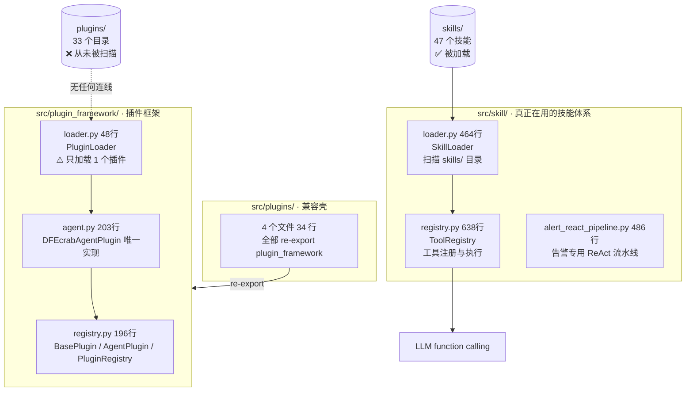

# 02.5 · `src/skill/` `src/plugin_framework/` `src/plugins/`

> 覆盖范围：**12 个 .py，共 2190 行**
> 分层：L4 能力层。系统「能用哪些工具」完全由这一组决定。
>
> 🔑 **本组回答了整个项目最关键的一个问题：技能到底从哪加载？答案是 `skills/`，不是 `plugins/`。**
>
> 上一页：[02.4-task与task_engine.md](./02.4-task与task_engine.md)　｜　下一页：[02.6-monitoring.mcp.reflection.services.md](./02.6-monitoring.mcp.reflection.services.md)

---

## 0. 三个包的关系（务必分清）



| 包 | 行数 | 性质 | 说明 |
|---|---|---|---|
| `src/skill/` | 1600 | **真正在用** | 技能加载 + 工具注册，Agent 的能力来源 |
| `src/plugin_framework/` | 461 | **在用，但只装了 1 个插件** | 插件框架，目前只有 `DFEcrabAgentPlugin` 一个实现 |
| `src/plugins/` | 34 | `[兼容壳]` | 4 个文件全是 re-export，**不是重复实现** |

---

## 1. `src/skill/` — 技能体系（1600 行）

| 项 | 内容 |
|---|---|
| **定位** | 技能加载、工具注册、匹配注入的完整链路 |
| **上游（谁用它）** | `src/agent/loop.py:32-33`（顶层 import `ToolRegistry`、`SkillLoader`）、`src/gateway/handlers/skill_handler.py` |
| **下游（它用谁）** | 仅标准库 + `skill/` 内部 |

### 1.1 `skill/loader.py`　★ 技能加载器

| 项 | 内容 |
|---|---|
| 类型 | 核心逻辑 · 加载器 |
| 规模 | 464 行 / 1 类 / 16 方法 |
| 职责 | 从 `skills/` 目录加载技能清单，并按用户输入匹配最相关的技能注入 system prompt |
| 核心符号 | `SkillLoader`（`match_skills` / `build_injected_prompt` / `_load_skill_manifest` / `_load_skill_manifests` / `_score_manifest` / `_extract_keywords` / `_extract_cjk_keywords` / `_extract_cjk_phrases` / `_parse_frontmatter` / `_extract_skill_metadata`）、`get_skill_loader()` |
| 被调用方 | `src/agent/loop.py:68`、`loop.py:193`（`build_injected_prompt`） |
| 依赖 | 仅标准库（`ast` / `json` / `re` / `pathlib`） |

**🔑 加载目录（决定性证据，第 64-65 行）：**

```python
def _get_skills_dir(self) -> Path:
    return self._get_project_root() / "skills"
```

**只扫 `skills/`，全文没有任何对 `plugins/` 的引用。**

**加载流程：**

1. 遍历 `skills/` 下每个子目录（跳过 `.` 开头的）
2. 读 `SKILL.md` → 解析 YAML frontmatter（`_parse_frontmatter`）+ 正文摘抄
3. 读 `_meta.json`（可选）
4. 用 **`ast.parse` 静态解析** `execute.py` 中的 `SKILL_METADATA` 常量 —— **不导入模块**（第 126-145 行），避免执行副作用
5. 合并出 `name` / `description` / `triggers` / `keywords` / `excerpt`

**匹配打分规则（`_score_manifest`，第 331-393 行）：**

| 命中类型 | 加分 | 说明 |
|---|---|---|
| 显式提到 `/skill_id` | **+100** | 用户写了斜杠命令 |
| 显式提到 `skill_id` 或 `/name` | **+30** | |
| trigger 命中 | **+20** | 来自 SKILL.md frontmatter 的 triggers |
| 关键词命中（中文 / 含点 / 长度≥6） | **+12** | |
| 关键词命中（其他） | **+5** | |
| 中文短语命中（长度≥3） | **+8** | 2~6 字滑窗，排除停用词 |
| description 含 `must`/`优先`/`必须` 且有关键词命中 | **+8** | |

- **过滤阈值**：`score < 12` 直接丢弃
- **注入上限**：`max_injected_skills = 3`（Top 3）
- **摘抄上限**：`max_excerpt_chars = 1600`，取前 40 个非空行

**停用词表：** `_STOPWORDS`（中英混合，约 40 个）、`_CJK_OVERLAP_STOPWORDS`、`_CJK_PREFIXES`；另有 `_FILE_EXTENSIONS` 用于识别 `.xlsx`/`.pdf` 等文件扩展名触发。

| 备注 | 模块 docstring 文件名写的是 `skill_loader.py`，实际是 `loader.py`；`_extract_cjk_phrases()` 做的是 2~6 字滑窗，对长中文串会产生较多候选 |

---

### 1.2 `skill/registry.py`　★ 工具注册表

| 项 | 内容 |
|---|---|
| 类型 | 核心逻辑 · 注册表 |
| 规模 | 638 行 / 2 dataclass + 1 类 / 20 方法 |
| 职责 | 扫描技能、注册为 OpenAI function-calling 格式的工具、统一执行与返回值 |
| 核心符号 | `ToolResult`（`status` / `content` / `error`）、`ToolInfo`（`source`：`"local"` \| `"mcp"`）、`ToolRegistry`（`execute_tool` / `list_tools` / `list_tools_for_agent` / `find_alternative_tool` / `get_tool_defaults` / `reload` / `_discover_tools` / `_discover_mcp_tools` / `_load_tool`）、`get_tool_registry()` |
| 被调用方 | `src/agent/loop.py:32`、`loop.py:67` |
| 依赖 | 标准库 + `importlib`（动态导入 skill 的 `execute.py`） |

**关键常量与行为：**

| 项 | 值 / 行为 | 位置 |
|---|---|---|
| `SYSTEM_SKILLS_BLACKLIST` | `{"planner", "project_memory"}` —— 这两个**不会被 LLM 当作工具调用** | 第 62 行 |
| `MAX_MCP_TOOLS_PER_AGENT` | **30** —— MCP 工具注入上限，超过则**整组不注入**（fail-safe）。注释说明：内网 14B 模型实测 200+ 工具触发 400 Bad Request → ReAct 空转 | 第 24-26 行 |
| 本地工具发现 | `_discover_tools()` 扫描 `skills/`，用 `importlib.util.spec_from_file_location` 动态加载 `execute.py` 的 `execute` 函数 | 第 103 行 |
| 参数推断 | `_infer_parameters()` 用 `inspect` 读函数签名；`_extract_docstring()` 读文档字符串作为描述 | 第 253/261 行 |
| 返回值归一化 | `_normalize_result()` 把 skill 返回的任意类型统一成 `ToolResult` | 第 347 行 |
| Agent 级过滤 | `list_tools_for_agent(agent_id, bound_servers_override)` 读 `agents/{id}/config.json` 的 `skills_whitelist` | 第 384 行 |
| 替代工具 | `find_alternative_tool()` —— `loop.py` 的 L2 自愈依赖它 | 第 560 行 |
| 默认参数 | `get_tool_defaults()` —— `loop.py` 的 L1 自愈依赖它 | 第 630 行 |

| 备注 | `ToolRegistry` 是 `__new__` 实现的单例，且用 `_initialized` 标志防止 `__init__` 重复执行（第 64-75 行）——这是正确的单例写法 |

---

### 1.3 `skill/alert_react_pipeline.py`

| 项 | 内容 |
|---|---|
| 类型 | 核心逻辑 · 专用流水线 |
| 规模 | 486 行 / 2 类 + 8 函数 |
| 职责 | **告警研判专用**的 ReAct 流水线，独立于 `loop.py` |
| 核心符号 | `_AlertConfig`、`_StreamThoughtSplitter`（流式思考/动作分段器）、`TOOL_NAME_MAPPING`、`run(alert_json, correlation_id)`、`_execute_via_mcp`、`_map_tool_name`、`_fix_mojibake`、`_extract_mcp_text`、`_parse_action_inputs`、`_make_event` |
| 关键行为 | ① 用正则切分 LLM 流式输出中的 `Action:` / `Action Input:` / `Final Answer:` / `Observation:` 段落（第 209-212 行的 4 个正则常量）；② `_fix_mojibake()` 修复乱码；③ 通过 `_execute_via_mcp()` 调 MCP 工具；④ 文本式 ReAct（解析自然语言 Action）而非 function calling |

| 备注 | ⚠️ 这是一套**独立于 `loop.py` 的第二套 ReAct 实现**，采用「文本解析 Action」而非 function calling。与 `loop.py` 构成双套执行引擎，需确认其启用条件 |

---

## 2. `src/plugin_framework/` — 插件框架（461 行）

| 项 | 内容 |
|---|---|
| **定位** | 插件体系：基类 + 注册表 + 加载器 + 唯一实现 |
| **现状** | **框架完整，但只装了 1 个插件**（`DFEcrabAgentPlugin`） |

### 2.1 `plugin_framework/registry.py`

| 项 | 内容 |
|---|---|
| 类型 | 核心逻辑 · 注册表 |
| 规模 | 196 行 / 3 类 |
| 职责 | 插件基类与注册表 |
| 核心符号 | `BasePlugin`（`initialize` / `shutdown` / `is_initialized`）、`AgentPlugin`（继承 `BasePlugin`，增加 `chat` / `chat_stream` / `list_agents` / `create_agent` / `delete_agent`）、`PluginRegistry`（`register` / `unregister` / `get` / `list_plugins` / `initialize_all` / `shutdown_all` / `get_instance` / `reset`）、`get_plugin_registry()` |
| 被调用方 | `src/gateway/handlers/agent_handler.py:8`（`get_plugin_registry()` → `registry.get("agent")`）、`src/plugin_framework/loader.py` |
| 关键行为 | `PluginRegistry` 用 `get_instance()` 类方法做单例，并提供 `reset()` 供测试 |

### 2.2 `plugin_framework/agent.py`

| 项 | 内容 |
|---|---|
| 类型 | 核心逻辑 · 插件实现 |
| 规模 | 203 行 / 1 类 / 9 方法 |
| 职责 | `DFEcrabAgentPlugin` —— **本项目唯一的插件实现** |
| 核心符号 | `DFEcrabAgentPlugin`（`initialize` / `_load_llm_config` / `_call_llm` / `chat` / `chat_stream` / `get_session_history` / `clear_session`）、`create_agent_plugin()` / `register_agent_plugin()` |
| 依赖 | `src.plugin_framework.registry.AgentPlugin`、函数内 `import openai` |
| 关键行为 | `_load_llm_config()` 读取配置；`chat()` / `chat_stream()` 直接调 LLM；`get_session_history()` / `clear_session()` 管理会话 |
| 备注 | 这是 `handlers/agent_handler.py` 通过 `registry.get("agent")` 拿到的对象——即 **Agent 管理 API 的数据源** |

---

### 🔴 2.3 `plugin_framework/loader.py` — 顶层 `plugins/` 从未被加载的决定性证据

| 项 | 内容 |
|---|---|
| 类型 | 核心逻辑 · 加载器 |
| 规模 | **48 行** / 1 类 / 1 方法 |
| 职责 | 名义上的「插件加载器」 |

**完整实现（第 13-41 行）：**

```python
async def load_all(self) -> int:
    try:
        # 加载 dfecrab.json 中的 default_agent 配置
        agent_plugin = DFEcrabAgentPlugin()      # ← 硬编码，只实例化这一个
        self._registry.register(agent_plugin)
        await agent_plugin.initialize({"agents": [default_agent_config]})
        self._loaded = 1                          # ← 恒为 1
        logger.info("✅ DFEcrabAgentPlugin 已加载并初始化")
    except Exception as e:
        logger.error(f"AgentPlugin 加载失败: {e}")
    return self._loaded

_instance = None
def get_plugin_loader(plugin_dir=None):          # ← 接受 plugin_dir 参数
    global _instance
    if _instance is None:
        _instance = PluginLoader()               # ← 但从不使用 plugin_dir
    return _instance
```

> ### 🔴 结论（三重重证据，已在阶段 0/1/2 反复核实）
>
> | 证据 | 说明 |
> |---|---|
> | ① `load_all()` 硬编码 | 全文只 `DFEcrabAgentPlugin()` 一次，**没有任何目录遍历** |
> | ② `plugin_dir` 参数被忽略 | `get_plugin_loader(plugin_dir=None)` 接受参数但**完全不使用**——签名暗示目录加载，实现却是空承诺 |
> | ③ `SkillLoader` 只扫 `skills/` | `src/skill/loader.py:64-65` 硬编码 `project_root / "skills"` |
>
> **因此：顶层 `plugins/` 目录下的 33 个子目录、25 个 `execute.py`，从未被任何代码加载。**
>
> 推论：`PluginRegistry` 里**永远只有 1 个插件**，所以 `grpc_server.py:5202` 的 `/api/plugins` 系列接口只会返回这 1 项。

---

## 3. `src/plugins/` — 兼容壳（34 行）

| 文件 | 行数 | 内容 |
|---|---|---|
| `__init__.py` | 13 | re-export `plugin_framework` 的符号 |
| `agent_plugin.py` | 7 | re-export `DFEcrabAgentPlugin` |
| `loader.py` | 7 | re-export `PluginLoader` / `get_plugin_loader` |
| `registry.py` | 7 | re-export `get_plugin_registry` |

典型内容（`registry.py` 全文 7 行）：

```python
"""Plugin Registry - 兼容 re-export"""
from src.plugin_framework.registry import (  # noqa: F401
    BasePlugin, AgentPlugin, PluginRegistry, get_plugin_registry,
)
```

| 备注 | ℹ️ **这是正确的向后兼容做法，不是冗余代码**。目的是让旧的 `from src.plugins.registry import ...` 不报错。但 `examples/hello_plugin/README.md` 仍在教新用户写 `src.plugins.registry`——**应改为指向 `src.plugin_framework`** |

---

## 4. 本组发现汇总

| # | 级别 | 发现 | 位置 |
|---|---|---|---|
| 69 | 🔴 P0 | **顶层 `plugins/` 从未被加载**：`PluginLoader.load_all()` 硬编码只加载 1 个插件；`get_plugin_loader(plugin_dir=None)` 接受目录参数却从不使用 | `src/plugin_framework/loader.py` |
| 70 | 🟠 P1 | **双套 ReAct 引擎**：`src/agent/loop.py`（function calling 式）与 `src/skill/alert_react_pipeline.py`（文本解析 Action 式，486 行） | — |
| 71 | 🟠 P1 | **Agent 数据源两套**：`handlers/agent_handler.py` 走 `PluginRegistry` 的 `DFEcrabAgentPlugin`，而 `AgentConfig.list_agents()` 扫 `agents/` 目录 | — |
| 72 | 🟡 P2 | MCP 工具超过 30 个时**整组不注入**（fail-safe），可能导致 MCP 服务「静默失效」——不报错但工具全没了 | `src/skill/registry.py:26` |
| 73 | 🟡 P2 | `skill/loader.py` 与 `plugin_framework/loader.py` 的模块 docstring 文件名（`skill_loader.py` / 无）与实际文件名不符 | — |
| 74 | ℹ️ 澄清 | `src/plugins/` 是**正确的兼容壳**，不应删除；但示例文档应更新为指向 `src/plugin_framework` | — |

---

<div align="center">

**02.5 · skill 与 plugin_framework 完**　（12 / 12 个文件，2190 行）

上一页：[02.4-task与task_engine.md](./02.4-task与task_engine.md)　｜　下一页：[02.6-monitoring.mcp.reflection.services.md](./02.6-monitoring.mcp.reflection.services.md)

</div>