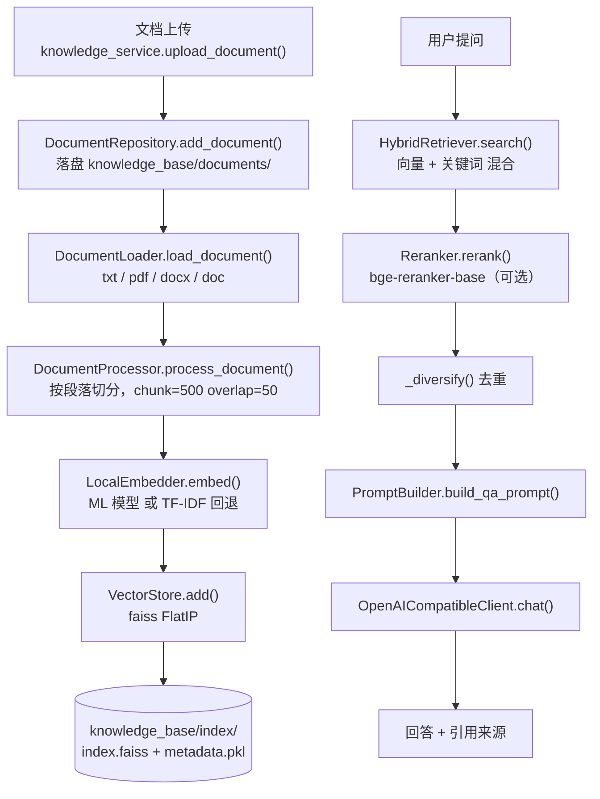

# 02.7 · `src/knowledge/` — 知识库（RAG）

> 覆盖范围：**19 个 .py，共 2126 行**
> 分层：L6 基础设施层。文档导入 → 切片 → 向量化 → 混合检索 → 重排 → LLM 生成。
>
> 🔑 **本组最重要的发现：当前索引 `dim=300`，说明用的是 TF-IDF 回退方案，而非 `models/` 里的 bge 模型。**
>
> 上一页：[02.6-monitoring.mcp.reflection.services.md](./02.6-monitoring.mcp.reflection.services.md)　｜　返回：[CODEMAP.md](../CODEMAP.md)

---

## 0. 目录结构与 RAG 链路

```
src/knowledge/
├── knowledge_service.py        432 行 · ★ 对外服务门面
├── __init__.py                   0 行 · ⚠ 空文件
│
├── core/                     检索核心（4 个 .py，498 行）
│   ├── retriever.py            169 · HybridRetriever 混合检索（向量 + 关键词）
│   ├── vector_store.py         136 · VectorStore（faiss）
│   ├── document_processor.py   116 · 文档切片（chunk_size=500, overlap=50）
│   ├── reranker.py              77 · Reranker（bge-reranker-base）
│   └── __init__.py               0 · ⚠ 空文件
│
├── embedding/                向量化（257 行）
│   ├── local_embedder.py       257 · ★ LocalEmbedder（ML 模型 or TF-IDF 回退）
│   └── __init__.py               0 · ⚠ 空文件
│
├── llm/                      LLM 客户端（82 行）
│   ├── openai_client.py         82 · OpenAICompatibleClient（同步 httpx）
│   └── ⚠ 无 __init__.py（命名空间包）
│
├── rag/                      RAG 编排（187 行）
│   ├── query_engine.py         134 · RAGQueryEngine
│   ├── prompt_builder.py        53 · PromptBuilder
│   └── __init__.py               0 · ⚠ 空文件
│
├── skills/                   知识技能实现（328 行）
│   ├── knowledge_qa.py         169 · KnowledgeQASkill
│   ├── knowledge_search.py     154 · KnowledgeSearchSkill
│   └── __init__.py               5 · 导出两者
│
└── storage/                  文档存储（342 行）
    ├── document_repo.py        219 · DocumentRepository（文档元数据管理）
    ├── document_loader.py      123 · DocumentLoader（txt/pdf/docx/doc 解析）
    └── __init__.py               0 · ⚠ 空文件
```

**RAG 完整链路：**



---

## 1. 核心文件详解

### 1.1 `knowledge/knowledge_service.py`　★ 服务门面

| 项 | 内容 |
|---|---|
| 类型 | 服务 · 门面 |
| 规模 | 432 行 / 1 类 / 14 方法 |
| 职责 | 知识库的对外服务：上传、检索、问答、列表、删除、统计 |
| 核心符号 | `KnowledgeService`（`upload_document` / `search` / `chat` / `list_documents` / `get_document_chunks` / `list_knowledge_bases` / `list_categories` / `delete_document` / `get_stats` / `_init_service` / `_load_llm_config` / `_rebuild_index_async`） |
| 被调用方 | `scripts/knowledge_api.py`（端口 6788 的知识库 API）、`dfecrab kb <子命令>` |
| 依赖 | `src.knowledge.skills.knowledge_qa.KnowledgeQASkill`（第 26 行延迟 import） |
| 关键行为 | ① `_init_service()` 延迟初始化，避免导入时加载模型；② `delete_document()` 后触发 `_rebuild_index_async()` 异步重建索引 |

| 备注 | docstring 提到支持多个知识库（`list_knowledge_bases`），但 `knowledge_base/` 目录结构显示为单一知识库 |

---

### 🔴 1.2 `knowledge/embedding/local_embedder.py` — 当前跑在 TF-IDF 回退上

| 项 | 内容 |
|---|---|
| 类型 | 适配器 · 向量化 |
| 规模 | 257 行 / 1 类 / 11 方法 |
| 职责 | 文本向量化，**自动检测模型：有模型用模型，无模型用 TF-IDF 分词** |
| 核心符号 | `LocalEmbedder`（`embed` / `embed_queries` / `get_dim` / `get_model_info` / `_try_load_ml_model` / `_find_model_path` / `_load_or_build_idf` / `_build_idf` / `_tokenize` / `_load_stopwords`） |
| 依赖 | `jieba`、`numpy`、`pickle` |
| 关联文件 | `models/bge-small-zh-v1.5/`、`models/idf_dict.pkl`、`models/vocab.pkl` |

**自动降级逻辑（第 20-55 行）：**

```python
self._try_load_ml_model()          # 先试 ML 模型
if not self.use_ml_model:
    logger.info("📝 使用 TF-IDF 分词方案")
    self.dim = 300                 # ← TF-IDF 固定 300 维
    self._load_or_build_idf()
else:
    logger.info(f"🤖 使用机器学习模型: {self.model_name}")
```

> ### 🔴 关键证据：当前索引是 TF-IDF（300 维），不是 bge 模型
>
> `knowledge_base/index/config.json` 内容：
> ```json
> {"dim": 300, "total_count": 9, "index_type": "FlatIP"}
> ```
>
> | 事实 | 说明 |
> |---|---|
> | `dim = 300` | **正好等于 TF-IDF 分支的 `self.dim = 300`**，说明建索引时**走的是 TF-IDF 回退路径** |
> | bge-small-zh-v1.5 应为 512 维 | 若走的是 ML 模型分支，dim 应为 512 |
> | `total_count = 9` | 索引中只有 9 个切片 |
> | `index_type = FlatIP` | 内积（余弦相似度）扁平索引，适合小数据量 |
>
> **结论**：`models/` 目录下虽然有 `bge-small-zh-v1.5`（12 个 json + 1 个 .bin），但**当前知识库实际并未使用神经嵌入模型**，检索质量停留在 TF-IDF + jieba 分词水平。
>
> **这正是 `dfecrab` 启动时 `_ensure_kb_index_aligned()` 要校验维度一致性的原因**——一旦模型加载成功（dim 变成 512）而索引仍是 300，检索就会维度不匹配报错，所以启动时会自动重建索引。

---

### 1.3 `knowledge/core/retriever.py`

| 项 | 内容 |
|---|---|
| 类型 | 核心逻辑 · 检索 |
| 规模 | 169 行 / 1 类 / 6 方法 |
| 职责 | **混合检索**：向量检索 + 关键词检索结果融合 |
| 核心符号 | `HybridRetriever`（`search` / `_keyword_search` / `_merge_results` / `_diversify` / `_build_text_cache` / `get_stats`） |
| 关键行为 | ① `_keyword_search()` 做关键词匹配；② `_merge_results()` 融合向量与关键词结果；③ `_diversify()` 去重多样性处理（避免同一文档的多个切片刷屏） |

### 1.4 `knowledge/core/vector_store.py`

| 项 | 内容 |
|---|---|
| 类型 | 适配器 · 向量存储 |
| 规模 | 136 行 / 1 类 / 6 方法 |
| 职责 | faiss 向量索引的增删改查与持久化 |
| 核心符号 | `VectorStore`（`__init__(dim, index_path)` / `add` / `search` / `save` / `load` / `clear` / `get_stats`） |
| 依赖 | `faiss`、`numpy` |
| 关联文件 | `knowledge_base/index/index.faiss`、`metadata.pkl`、`config.json` |

### 1.5 `knowledge/core/document_processor.py`

| 项 | 内容 |
|---|---|
| 类型 | 核心逻辑 · 切片 |
| 规模 | 116 行 / 2 类 / 5 方法 |
| 职责 | 文档切片 |
| 核心符号 | `DocumentChunk`、`DocumentProcessor`（`process_document` / `_split_by_paragraphs` / `_split_long_paragraph` / `_get_overlap_text` / `_create_chunk`） |
| 关键行为 | `chunk_size=500`、`overlap=50`；先按段落切，超长段落再二次切分，切分时带 50 字重叠 |

### 1.6 `knowledge/core/reranker.py`

| 项 | 内容 |
|---|---|
| 类型 | 适配器 · 重排 |
| 规模 | 77 行 / 1 类 / 3 方法 |
| 职责 | 检索结果重排 |
| 核心符号 | `Reranker`（`__init__(model_name="small", device="cpu")` / `_load_model` / `rerank` / `is_available`） |
| 依赖 | `models/bge-reranker-base` |
| 关键行为 | `is_available()` 可查询重排模型是否可用——不可用时上层应跳过重排（**这是正确的可选依赖设计**） |

---

### 1.7 `knowledge/rag/query_engine.py`

| 项 | 内容 |
|---|---|
| 类型 | 核心逻辑 · RAG |
| 规模 | 134 行 / 1 类 / 5 方法 |
| 职责 | RAG 问答编排：检索 → 组上下文 → 生成 |
| 核心符号 | `RAGQueryEngine`（`query` / `stream_query` / `_build_context` / `_build_local_answer` / `_generate_answer`） |
| 关键行为 | `_build_local_answer()` —— **LLM 不可用时用切片直接拼答案**（本地兜底），与 `_generate_answer()`（LLM 生成）形成降级链 |

### 1.8 `knowledge/rag/prompt_builder.py`

| 项 | 内容 |
|---|---|
| 类型 | 工具类 · 提示词 |
| 规模 | 53 行 / 1 类 / 4 方法 |
| 职责 | RAG 提示词组装 |
| 核心符号 | `PromptBuilder`（`build_qa_prompt` / `build_summary_prompt` / `build_chat_prompt` / `_default_system_prompt`） |

---

### 1.9 `knowledge/llm/openai_client.py`

| 项 | 内容 |
|---|---|
| 类型 | 适配器 · LLM |
| 规模 | 82 行 / 1 类 / 3 方法 |
| 职责 | 知识库专用的 LLM 客户端 |
| 核心符号 | `OpenAICompatibleClient`（`chat` / `stream_chat` / `_headers`） |
| 依赖 | **`httpx`（同步调用，第 6 行）** |
| 关键行为 | `api_key == "not-needed"` 时不发 `Authorization` 头；`max_tokens` 默认 4096（注释说明「调大，避免长回答被截断」） |

| 备注 | ⚠️ 这是**知识库专属的第二套 LLM 客户端**，与 `src/agent/llm/adapter.py`（696 行，httpx 异步）功能重叠。知识库 API 是独立进程（端口 6788），所以有独立客户端尚可理解，但维护成本是双份 |

---

### 1.10 `knowledge/skills/` — 知识技能实现

| 项 | 内容 |
|---|---|
| **定位** | 知识库能力的**实现类** |
| **规模** | 3 个 .py，共 328 行 |

| 文件 | 行数 | 职责 |
|---|---|---|
| `knowledge_qa.py` | 169 | `KnowledgeQASkill`（`execute` / `retrieve` / `get_info` / `is_ready` / `_init_llm_client` / `_init_engine`） |
| `knowledge_search.py` | 154 | `KnowledgeSearchSkill`（`execute` / `get_info` / `is_ready` / `_init_engine`） |
| `__init__.py` | 5 | 导出两者 + `SKILL_METADATA` |

> ✅ **这不是重复，是正确的分层**：
> - `src/knowledge/skills/` = 实现（Python 类）
> - `skills/knowledge_qa/execute.py` = 薄封装，暴露给 `SkillLoader`
>
> 实证：`skills/knowledge_qa/execute.py:14` 写的是 `from src.knowledge.skills.knowledge_qa import KnowledgeQASkill, SKILL_METADATA`，`skills/knowledge_search/execute.py:14` 同理。
> `scripts/test_knowledge_full.py:11` 也直接 import 实现层。

---

### 1.11 `knowledge/storage/` — 文档存储（342 行）

| 文件 | 行数 | 职责 |
|---|---|---|
| `document_repo.py` | 219 | `DocumentRepository` + `DocumentInfo`：文档元数据增删改查、`_load_mapping` / `_save_mapping` 持久化映射、状态更新、路径管理（`documents/` / `processed/` / `index/`） |
| `document_loader.py` | 123 | `DocumentLoader`：多格式解析 `_load_text` / `_load_pdf` / `_load_docx` / `_load_doc` + `_clean_text` |
| `__init__.py` | 0 | ⚠ 空文件 |

| 备注 | `document_loader.py` 与 `src/utils/word_reader.py`（读 .docx）、`skills/pdf-reader/` 存在**文档解析能力分散**的问题——pdf/docx 解析在三处各有一份 |

---

## 2. 本组发现汇总

| # | 级别 | 发现 | 位置 |
|---|---|---|---|
| 83 | 🔴 P0 | **知识库实际跑在 TF-IDF 回退上**：索引 `dim=300` 对应 TF-IDF 分支，说明 `models/bge-small-zh-v1.5`（512 维）**未生效**；`total_count` 仅 9 个切片 | `knowledge_base/index/config.json` + `local_embedder.py:48-53` |
| 84 | 🟠 P1 | **第二套 LLM 客户端**：`knowledge/llm/openai_client.py`（82 行，同步 httpx）与 `agent/llm/adapter.py`（696 行，异步 httpx）功能重叠 | — |
| 85 | 🟠 P1 | **文档解析能力分散三处**：`knowledge/storage/document_loader.py`、`utils/word_reader.py`、`skills/pdf-reader/` | — |
| 86 | 🟡 P2 | **`src/knowledge/` 下有 6 个 0 行 `__init__.py`**（根 + core/embedding/rag/storage）——与 `src/` 下其他包统一写懒加载导出的风格不一致 | — |
| 87 | 🟡 P2 | **`knowledge/llm/` 缺少 `__init__.py`**，靠 Python 3 命名空间包机制工作，与项目其他包不一致 | — |
| 88 | 🟡 P2 | `knowledge_service.py` 的 `list_knowledge_bases()` 暗示多知识库，但 `knowledge_base/` 是单一结构 | — |
| 89 | ✅ 澄清 | `src/knowledge/skills/` 与 `skills/knowledge_qa|knowledge_search/` **不是重复**，而是「实现层 + 封装层」的正确分层 | — |

---

## 3. 阶段 2 全部完成

`src/` 核心包共 **149 个 .py、约 27000 行**，全部覆盖完毕：

| 子阶段 | 文件数 | 行数 | 关键发现数 |
|---|---|---|---|
| [02.0 根与 core.config.utils](./02.0-根与core.config.utils.md) | 17 | 1714 | 10（含 🔴 明文 API Key） |
| [02.1 agent 与 LLM](./02.1-agent与LLM.md) | 17 | 4665 | 12（含 🔴 `create_plan` 不存在、两个 STUB） |
| [02.2 gateway 网关层](./02.2-gateway网关层.md) | 31 | 12917 | 11（含 🔴 5305 行上帝类、事件协议分裂） |
| [02.3 memory 与 session](./02.3-memory与session.md) | 23 | 4575 | 9（含 🔴 4 行空类 `MemoryManager`） |
| [02.4 task 与 task_engine](./02.4-task与task_engine.md) | 24 | 3280 | 10（含 🔴 `backup/` 未清理、定时调度空壳） |
| [02.5 skill 与 plugin_framework](./02.5-skill与plugin_framework.md) | 12 | 2190 | 6（含 🔴 `plugins/` 从未加载的实锤） |
| [02.6 monitoring.mcp.reflection.services](./02.6-monitoring.mcp.reflection.services.md) | 12 | 1889 | 8（含 🔴 `service_registry` 恒报健康） |
| [02.7 knowledge 知识库](./02.7-knowledge知识库.md) | 19 | 2126 | 7（含 🔴 索引跑在 TF-IDF 上） |
| **合计** | **155** | **33356** | **73 条**（发现编号 17–89） |

---

<div align="center">

**02.7 · knowledge 知识库 完**　（19 / 19 个文件，2126 行）

**🎉 阶段 2 全部完成**　上一页：[02.6-monitoring.mcp.reflection.services.md](./02.6-monitoring.mcp.reflection.services.md)　｜　返回：[CODEMAP.md](../CODEMAP.md)

</div>