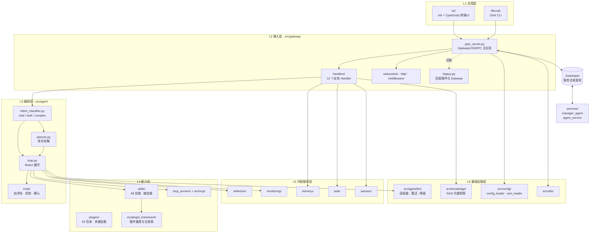
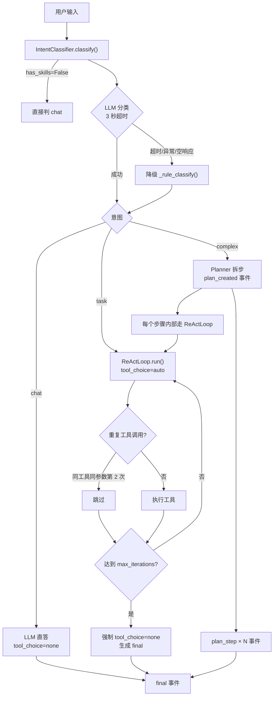
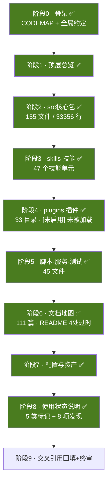

# DFEcrab 代码地图 · 总索引

> 面向**开发人员**的全仓库结构说明书：每个目录是干什么的、每个文件的代码是什么、和谁相关。
>
> 阅读顺序建议：**本页 → [00-全局约定.md](./00-全局约定.md) → 按需跳各分项文档**
>
> 生成时间：2026-08-29　｜　覆盖：A 级逐文件 / B 级逐篇 / C 级目录级

---

## 1. 项目速览

| 项 | 内容 |
|---|---|
| **名称** | DFEcrab v4.1 —— 电网运维智能助手 |
| **定位** | 面向电网调度与故障评估场景的分布式智能体平台 |
| **架构** | 微内核 + 插件化；模型驱动意图识别 + ReAct 工具循环 |
| **主语言** | Python 3.12.7（线上为 3.12.7，README 声明 3.10+） |
| **源码规模** | Python 源文件 273 个（已排除 venv / node_modules） |
| **文档规模** | Markdown 218 篇 |
| **服务形态** | Gateway(6789) + WebSocket(6790) + 知识库 API(6788) + 若干本地 MCP 服务 |
| **默认 LLM** | OpenAI 兼容接口，示例为 `Qwen3-Coder-30B` |

---

## 2. 技术栈

来源：`requirements.txt`（注释说明为线上环境 `pip freeze`，2026-08-25）

| 分类 | 选型 | 版本 |
|---|---|---|
| Web 网关 | fastapi / uvicorn / starlette / sse-starlette / Flask | 0.135.3 / 0.44.0 / 1.6.0 / 3.4.8 / 3.1.3 |
| 实时通信 | websockets | 17.0.1 |
| HTTP 客户端 | requests / httpx / aiohttp | 2.33.1 / 0.28.1 / 3.13.5 |
| 配置与校验 | PyYAML / pydantic / jsonschema | 6.0.3 / 2.12.5 / 4.26.0 |
| LLM | openai | 3.0.0 |
| 向量与深度学习 | torch / sentence-transformers / transformers | 2.4.1 / 6.0.0 / 5.x |
| 向量检索 | faiss-cpu / jieba | 1.8.0 / 0.42.1 |
| RPC 与服务发现 | grpcio / protobuf / kazoo(Zookeeper) | 1.80.0 / 7.34.1 / 2.11.0 |
| MCP | mcp / fastmcp | 1.29.0 / 3.4.7 |
| CLI / 终端 | click / rich | 8.3.2 / 15.0.0 |
| 认证加密 | PyJWT / cryptography / Authlib | 2.13.0 / 50.0.0 / 1.7.2 |
| 文档解析 | python-docx / lxml | 1.2.0 / 6.1.2 |
| 运维工具 | psutil / watchfiles | 7.2.2 / 1.2.0 |

> 注意：`requirements.txt` 自带注释提到，环境中存在异常包 `httpx2` / `httpcore2`（疑似重复安装）已剔除，建议排查。

---

## 3. 入口系统（两个，务必区分）

本项目存在**两套并存的入口**，命令风格完全不同，新人极易混淆。

### 3.1 主入口：根目录 `dfecrab`（Click，1119 行）

实际生产使用的启动器。无扩展名的可执行脚本。

| 命令 | 作用 |
|---|---|
| `./dfecrab start` | 启动 Gateway + Agent + 知识库 + 本地 MCP 全套服务 |
| `./dfecrab stop` | 停止 Gateway + Agent（知识库与 MCP 保持运行） |
| `./dfecrab stopall` | 停止全部服务，并清理 Zookeeper 残留节点 |
| `./dfecrab status` | 查看 Gateway / 知识库 / MCP 运行状态 |
| `./dfecrab chat "消息"` | 通过 Gateway 发送单条对话 |
| `./dfecrab test` | 运行 `tests/test_grpc_architecture.py` 集成测试 |
| `./dfecrab start-knowledge` / `stop-knowledge` | 单独管理知识库 API（端口 6788） |
| `./dfecrab start-mcp` / `stop-mcp` | 单独管理本地 MCP 服务 |
| `./dfecrab kb <子命令>` | 知识库操作：`upload` / `search` / `chat` / `list` / `stats` / `health` |

**启动流程（`start` 命令内部顺序）：**

1. `_cleanup_zk()` —— 清理 Zookeeper 残留临时节点（防止误判「已注册，跳过自动启动」）
2. 端口占用检测 —— Gateway HTTP / WebSocket 被占用则**直接退出**
3. 启动知识库 API（失败不阻塞，仅告警）——启动前 `_ensure_kb_index_aligned()` 校验嵌入维度与索引维度是否一致，不一致则自动重建
4. 启动本地 MCP 服务（失败不阻塞）——端口以 `config/gateway.yaml` 的 `local_ports.mcp` 为**单一事实源**，与 `mcporter.json` 不一致时告警
5. 启动 Gateway（`scripts/start_gateway_grpc.py`）
6. 轮询 `/health` 最多 15 秒等待就绪

**已知细节：**

- shebang 硬编码为 `#!/home/e8900/DFEcrab/venv/bin/python3`（Linux 绝对路径），在 Windows 下需显式用 Python 调用。
- 导入路径依赖 `sys.path` 顺序：先插 `project_root`，再插 `project_root/src`，因此 `from config.config_loader import config` 实际解析到 **`src/config/config_loader.py`**，而非根 `config/` 目录。
- 启动 MCP 子进程时**主动清除 `PYTHONPATH`**——因为项目自带 `src/mcp/` 会遮蔽 pip 的 `mcp` 包，导致 `import mcp.types` 失败。

### 3.2 次入口：`python -m src`（argparse，213 行）

`src/__main__.py`，提供另一套命令，与 `dfecrab` CLI **不互通**。

| 命令 | 作用 |
|---|---|
| `python -m src gateway start/stop/restart/status` | 管理 Gateway，支持 `--mode grpc`（默认，含 WS）与 `--mode plugin`（旧版，无 WS） |
| `python -m src tui` | 启动 Ink 终端 UI，实际执行 `node tui/cli.js` |
| `python -m src mcp-server start/status` | 管理 MCP Server 暴露，支持 stdio / sse / streamable-http |

> `--mode plugin` 分支会走 `src/gateway/legacy.py`，属于旧版插件化 Gateway（无 WebSocket）。
> `--version` 输出为 `DFEcrab v3.0.0`，与根 `dfecrab` 的 `4.0.0-grpc` **版本号不一致**。

---

## 4. 全局架构

---

## 5. 对话链路（v4.1）

**事件流类型（v4.0 现行，定义于 `src/core/event_types.py`）：**

`think_start` / `think`（多次增量）/ `think_end` / `tool_start` / `tool_progress` / `tool_call` / `tool_result` / `plan_created` / `plan_step` / `skill_match` / `confirmation` / `message_start` / `message_end` / `error`

> ⚠️ 旧文档中的 `thinking` 与 `final` **已分别被 `think` 三段式和 `message_end` 取代**。详见 [02.2-gateway网关层.md](./02-src核心包/02.2-gateway网关层.md) 的「事件协议分裂」说明。

**v4.1 关键约定：**

| 约定 | 说明 |
|---|---|
| `tool_choice` 动态化 | chat → `none`，task / complex → `auto`（不再硬编码 `required`） |
| 死循环防护 | 同工具同参数第 2 次调用直接跳过 |
| final 保证 | 达到 `max_iterations` 后强制 `tool_choice=none` 生成总结，不再 yield error；另有 120 秒总超时兜底 |
| 工具黑名单 | `planner` / `project_memory` 加入 `ToolRegistry` 黑名单，不被 LLM 当工具调用 |
| 工具三级自愈 | L1 补默认参数重试 → L2 找替代工具 → L3 发起人工确认 |
| MCP 工具上限 | 单个 Agent 的 MCP 工具超过 30 个则**整组不注入**（fail-safe） |
| `max_iterations` | ⚠️ **代码层三处默认值不一致**，但**配置层统一为 10**：`config/dfecrab.json` 的 `agent_defaults.max_iterations = 10`（**实际生效值**）；代码兜底为 `ReActLoop.__init__`=3、`run_react_loop()`=5、`AgentConfig`=3（仅当配置文件缺失时生效） |

---

## 6. 顶层目录总表

文件数统计于 2026-08-29（已排除 `venv/` / `__pycache__/` / `node_modules/` 内部统计口径外的部分，括号内为明细）。

### 6.1 源码与工程（A 级，逐文件详写）

| 目录 | 规模 | 分层 | 定位 |
|---|---|---|---|
| `src/` | 346（149 py、1 proto、1 html、1 db） | L2–L6 | **核心 Python 源码**，12 个子包：gateway / agent / memory / task / session / skill / plugin_framework / plugins / reflection / monitoring / mcp / knowledge |
| `skills/` | 167（58 md、48 py、14 json、2 sh） | L4 | **技能实现目录**，48 个子目录。**唯一被 `SkillLoader` 扫描加载的能力来源** |
| `plugins/` | 62（36 md、25 py） | L4 | **`[未启用]`** 插件目录，33 个子目录。PluginLoader 硬编码只加载 DFEcrabAgentPlugin，未扫描此目录；与 `skills/` 大量字节级重复（非废弃，是设计了但没接） |
| `scripts/` | 22（15 py、2 sh） | 运维 | 启动脚本、知识库运维脚本、系统体检脚本 |
| `services/` | 9（3 py、2 sh） | 服务层 | gRPC 服务实现：`manager_agent`（144 KB）、`agent_service`（135 KB） |
| `tests/` | 31（26 py、1 html） | 质量 | 测试，含 `core/` / `memory/` / `plugins/` 三个子目录 |
| `task_engine/` | 10（8 py、1 md、1 txt） | — | `[开发中]` 早期任务引擎原型。已被 `src/task/` 取代，全仓库无外部引用 |
| `examples/` | 3（1 py、1 json、1 md） | 示例 | 仅 `hello_plugin/` 一个示例插件 |

### 6.2 文档（B 级，逐篇摘要）

| 目录 | 规模 | 定位 |
|---|---|---|
| `docs/` | **101 md** | 项目文档主目录。分布：设计说明书 29 / 用户手册 17 / 代码地图 15 / 05-历史文档 13 / 集成分析 9 / 根目录 5 / 测试报告 5 / design 2 / plugins 2 / 开发计划 2 / 验收手册 2（另含 2 个空目录） |
| `前端对接文档/` | 10 md | 面向前端的接口对接说明（对话、Agent、MCP、任务、会话、技能、模型、用户、知识库、记忆） |

### 6.3 配置与资产（C 级，目录级）

| 目录 | 规模 | 定位 |
|---|---|---|
| `config/` | 9（6 json、1 yaml、2 pyc） | 运行期配置文件。**注意：无 .py**，真正的配置模块在 `src/config/` |
| `agents/` | 17（17 json） | Agent 定义（alert_judge / code_writer / dfecrab / knowledge_agent / kunming / manager_agent） |
| `knowledge_base/` | 21（7 txt、5 json、3 docx、3 md、1 faiss） | 知识库数据：documents 源文档、index 向量索引、processed 切片、cache 缓存 |
| `models/` | 20（12 json、2 bin、2 pkl、2 md） | 本地嵌入模型 `bge-small-zh-v1.5` 与重排模型 `bge-reranker-base` |
| `mcp_servers/` | 10953（10756 xml、149 js、16 json、7 md、5 py） | MCP 服务。`blackxml-topology-mcp/` 内含 node_modules，**仅 5 个 .py 是本项目代码** |
| `tui/` | 1849（1239 js、348 ts、71 json、59 md） | Ink + TypeScript 终端 UI 子项目，**自有 npm 依赖**，源码仅 `src/` 下 4 个文件 |

### 6.4 运行时产物与第三方（仅登记，不逐文件展开）

| 目录 | 规模 | 说明 |
|---|---|---|
| `data/` | 2268（2253 json、15 md） | `[运行时产物]` tasks 1958、sessions 260、reflections 32、shared_memory 18 |
| `logs/` | — | `[运行时产物]` Gateway / knowledge / mcp 三类日志 |
| `decks/` | 19（18 html、1 pptx） | 生成的演示文稿产出物 |
| `runtime/` | 24（5 .so、若干无扩展名） | **`[项目环境]`** Alpine musl Node.js v24.16.0，blackxml_topology MCP 子进程依赖 |
| `wheels/` | 43（42 whl、1 gz） | **`[项目环境]`** pip 离线安装包（venv/ 已包含），目标机器无外网时用 |
| `venv/` | 941（774 py） | **`[项目环境]`** Python 3.12 虚拟环境，部署必需 |
| `__pycache__/` | — | `[生成物]` 字节码缓存 |
| `proto/` | 空 | 空目录 |
| `reflections/` | 空 | 空目录（实际反思数据在 `data/reflections/`） |

### 6.5 根级文件

| 文件 | 定位 |
|---|---|
| `dfecrab` | **主入口**，Click CLI，1119 行。见第 3.1 节 |
| `README.md` | 项目说明，含架构、快速开始、版本历史（v4.1 / v4.0 / v3.x） |
| `requirements.txt` | 依赖清单，带详细分区注释 |
| `.gitignore` | 版本控制忽略规则（`logs/` 等目录因此未在目录树中显示） |

---

## 7. 文档导航

| 文档 | 覆盖范围 | 状态 |
|---|---|---|
| [CODEMAP.md](./CODEMAP.md) | 本页：总索引、架构、入口、顶层目录总表 | ✅ 已完成 |
| [00-全局约定.md](./00-全局约定.md) | 术语表、标记图例、条目模板、分层定义、编写纪律 | ✅ 已完成 |
| [01-顶层目录总览.md](./01-顶层目录总览.md) | 顶层每个目录 + 根级文件的完整描述 | ✅ 已完成 |
| [02-src核心包/02.0-根与core.config.utils.md](./02-src核心包/02.0-根与core.config.utils.md) | `src/` 根 3 个文件 + `core/` + `config/` + `utils/`（17 文件 / 1714 行） | ✅ 已完成 |
| [02-src核心包/02.1-agent与LLM.md](./02-src核心包/02.1-agent与LLM.md) | `src/agent/`：loop、planner、intent、llm/、multi/（17 文件 / 4665 行） | ✅ 已完成 |
| [02-src核心包/02.2-gateway网关层.md](./02-src核心包/02.2-gateway网关层.md) | `src/gateway/`：grpc/、handlers/、http/、websocket/（31 文件 / 12917 行） | ✅ 已完成 |
| [02-src核心包/02.3-memory与session.md](./02-src核心包/02.3-memory与session.md) | `src/memory/`（modules/、search/、storage/）+ `src/session/`（23 文件 / 4575 行） | ✅ 已完成 |
| [02-src核心包/02.4-task与task_engine.md](./02-src核心包/02.4-task与task_engine.md) | `src/task/`（含 backup/）+ `task_engine/`（24 文件 / 3280 行） | ✅ 已完成 |
| [02-src核心包/02.5-skill与plugin_framework.md](./02-src核心包/02.5-skill与plugin_framework.md) | `src/skill/`、`src/plugin_framework/`、`src/plugins/`（12 文件 / 2190 行） | ✅ 已完成 |
| [02-src核心包/02.6-monitoring.mcp.reflection.services.md](./02-src核心包/02.6-monitoring.mcp.reflection.services.md) | `src/monitoring/`、`mcp/`、`reflection/`、`services/`（12 文件 / 1889 行） | ✅ 已完成 |
| [02-src核心包/02.7-knowledge知识库.md](./02-src核心包/02.7-knowledge知识库.md) | `src/knowledge/`：core/、embedding/、llm/、rag/、skills/、storage/（19 文件 / 2126 行） | ✅ 已完成 |
| [03-skills技能.md](./03-skills技能.md) | `skills/` 全部 **47 个技能单元** | ✅ 已完成 |
| [04-plugins插件.md](./04-plugins插件.md) | `plugins/` 全部 **35 个目录**（33 个非空）+ 与 `skills/` 的逐文件比对与删除建议 | ✅ 已完成 |
| [05-scripts与services.md](./05-scripts与services.md) | `scripts/`(15 py) + `services/`(3 py)，9111 行 | ✅ 已完成 |
| [06-tests与examples.md](./06-tests与examples.md) | `tests/`(26 py, 70 个测试函数) + `examples/` | ✅ 已完成 |
| [07-docs文档地图.md](./07-docs文档地图.md) | `docs/**` **101 篇** + `前端对接文档/` 10 篇 = 111 篇，含文档与实现一致性核查 | ✅ 已完成 |
| [08-配置与数据资产.md](./08-配置与数据资产.md) | `config/`、`agents/`、`knowledge_base/`、`models/`、`mcp_servers/`、`tui/`、`data/` 等 12 个资产目录 | ✅ 已完成 |
| [09-冗余重复专项报告.md](./09-冗余重复专项报告.md) | 全仓库代码使用状态说明（5 类核心标记：主使用/未启用/开发中/已废弃/项目环境 + 8 项发现 + 安全 S1–S6） | ✅ 已完成 |

---

## 8. 已核实的结构性发现

以下 8 条在**阶段 0 的实际代码核查中已验证**（非推测）；阶段 1 又新增 8 条（编号 9–16），见 [01-顶层目录总览.md](./01-顶层目录总览.md) 第 6 节。完整分析与处理建议见 `09-冗余重复专项报告.md`。

| # | 级别 | 发现 | 证据 | 状态标记 |
|---|---|---|---|---|
| 1 | 🟠 P1 | **顶层 `plugins/` 未被加载**（非废弃，是设计了 loader 但硬编码跳过） | `src/plugin_framework/loader.py` 全文 48 行，`load_all()` **硬编码**只加载 `DFEcrabAgentPlugin` 一个实例，从不扫描 `plugins/` 目录；且 `get_plugin_loader(plugin_dir=None)` **接受目录参数却从不使用** | `[未启用]` |
| 2 | 🟠 P1 | **`plugins/` 与 `skills/` 大量字节级重复** | 25 个 `execute.py` 中：12 个 **MD5 完全相同**；5 个**仅差 1 行 import**（`from agentscope.service` → `from src.agentscope_compat`，恰好 3 字节）；2 个**仅命名不同**（连字符 vs 下划线）。但 plugins/ 不是废弃，是迁移时忘了清理 | `[未启用] + [重复]` |
| 3 | 🔴 P0 | **`self-improving-agent` 已损坏** | `skills/` 与 `plugins/` 两份都 import `src.agent.SelfImprovingAgent`、`src.hooks.HookManager`、`src.memory.LearningMemory`；经全仓搜索，这三个符号**当前均不存在**（仅有 `src/monitoring/hooks.py` 中的 `HookManager`，且路径不同） | `[开发中] + [已损坏]` |
| 4 | 🟡 P2 | **`task_engine/` 完全孤立** | 全仓 grep `task_engine` 仅命中其自身内部 2 处（`example.py` → `cli_integration.py`），无任何外部 import。是早期原型，已被 `src/task/` 取代 | `[开发中]` |
| 5 | 🔴 P0 | **memory 层三套管理器并存，其中一个是 4 行空类** | `src/memory/__init__.py` 懒加载同时导出 `UnifiedMemoryManager`（773 行真实现）、`MemoryManager`（**4 行空类**）、`LongTermMemoryManager`（410 行真实现）。还有命名不一致：`unified_manager` vs `unified_memory_manager` | `[开发中]` |
| 6 | 🟡 P2 | **三个重建索引脚本功能重叠** | `scripts/rebuild_index.py`、`rebuild_knowledge_index.py`、`rebuild_knowledge_chunks.py` | `[已废弃]`（可留一个） |
| 7 | 🟡 P2 | **空目录 3 个，其一为命名事故** | `docs/{设计说明书，用户手册，测试报告，验收手册}/`（目录名含中文全角逗号）、`docs/测试报告/04-问题跟踪/` | `[已废弃]` |
| 8 | 🟢 — | **venv / wheels / runtime 是项目环境**（原分类错了） | 之前标为"生成物"，实际是用户的 Python 虚拟环境 + pip 离线包 + Alpine musl Node.js，部署必需 | `[项目环境]` |

### 🔴 安全问题专项（建议优先处理）

阶段 2–3 核查中发现的**凭据与代码执行风险**，均为明文硬编码，建议尽快处理：

| # | 风险 | 位置 | 建议 |
|---|---|---|---|
| S1 | **智谱 GLM API Key 明文** | `src/config/config.py:72` | 轮换 Key + 改环境变量 |
| S2 | **达梦数据库密码明文**（3 处） | `skills/dm_query/execute.py:36`、`skills/dm_meta/execute.py:16`、`skills/dm_test/dm_test.py:9` | 改环境变量，**不设默认值** |
| S3 | **环境变量兜底值是明文密码**（伪装成安全写法） | `skills/dm_test/src/config.py:10` `os.getenv("DM_PASSWORD", "ytdf000000")` | 去掉默认值，缺失时报错 |
| S4 | **`eval()` 可任意代码执行** | `skills/calculate/execute.py:16` | 改 `ast.literal_eval()` 或安全表达式解析器 |
| S5 | **代码沙箱为黑名单机制**（代码注释自承不完整） | `skills/code_executor/execute.py:19` | 评估是否需升级为白名单或容器隔离 |
| S6 | **内网 IP 明文**（4 处） | `dm_query:37`、`kunming_api:14`、`asr_corrector:200`、`get-http:59` | 移入配置文件 |

### 需要澄清的两点（非缺陷，但极易误判）

| 项 | 澄清 |
|---|---|
| `src/plugins/` 不是冗余 | 4 个文件（279 B / 211 B / 279 B / 588 B）全部是**向后兼容壳**，内容为 re-export `src/plugin_framework` 对应模块，保留旧 import 路径不报错 |
| 根 `config/` 不是 Python 包 | 无任何 .py（仅 2 个残留 .pyc，是迁移前的历史产物）；`dfecrab` 中 `from config.config_loader import config` 实际解析到 **`src/config/config_loader.py`** |

---

## 9. 阶段推进计划

| 阶段 | 条目数（估） | 子步骤 |
|---|---|---|
| 0 骨架 | 2 篇 | ✅ 完成 |
| 1 顶层总览 | 32 个目录 + 4 个根文件 | ✅ 完成 |
| 2 src 核心包 | **155 文件 / 33356 行** | ✅ 完成。2.0(17) → 2.1(17) → 2.2(31) → 2.3(23) → 2.4(24) → 2.5(12) → 2.6(12) → 2.7(19)，累计新发现 73 条（编号 17–89） |
| 3 skills | **47 个技能目录** | ✅ 完成。新发现 15 条（编号 90–104），含 2 项安全问题、3 个已损坏技能 |
| 4 plugins | **33 个目录** | ✅ 完成。标记为 `[未启用]`——PluginLoader 硬编码跳过但目录结构完整，非废弃。与 skills/ 大量重复待后续决定是否合并 |
| 5 脚本·服务·测试 | **45 文件 / ~14000 行** | ✅ 完成。新发现 20 条（编号 114–133） |
| 6 文档地图 | **111 篇** | ✅ 完成。新发现 10 条（编号 134–143），含 `README.md` 4 处与实现不一致 |
| 7 配置与资产 | **12 个目录** | ✅ 完成。修正 venv/wheels/runtime 分类为 `[项目环境]` |
| 8 使用状态说明 | 1 报告（5 类标记 + 8 项发现） | ✅ 完成。分类体系从"可删/僵尸"转向"主使用/未启用/开发中/已废弃/项目环境" |
| 9 终审 | — | 交叉引用回填 + 断链检查（未开始） |

---

**本页为 `docs/代码地图/` 总索引**

上一页：无　｜　下一页：[00-全局约定.md](./00-全局约定.md)

